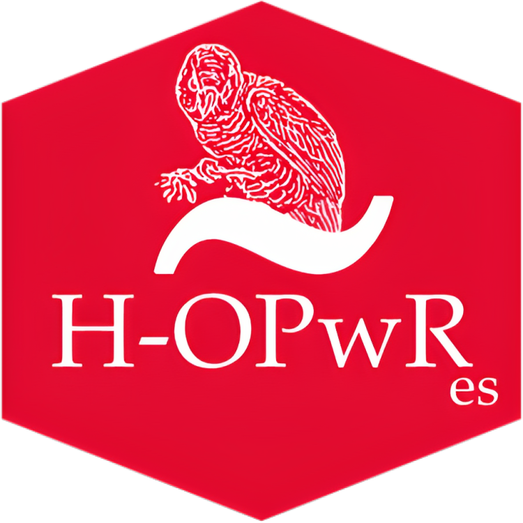
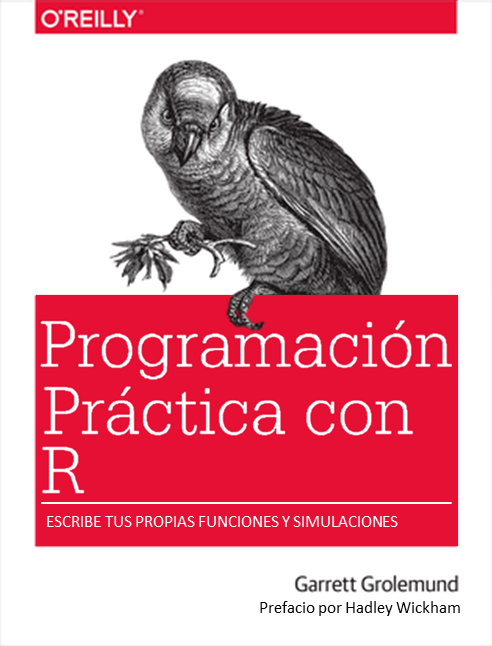

# Español

## Programación práctica con R

 Este es el sitio web para la versión en español de **"Programación práctica con R"** de Garrett Grolemund. Este libro le enseñará cómo programar en R, con ejemplos prácticos. Fue escrito para personas que no son programadores con el objetivo de proporcionar una introducción amigable al lenguaje R. Aprenderá a cargar datos, ensamblar y desensamblar objetos de datos, navegar por el sistema de entorno de R, escribir sus propias funciones y utilizar todas las herramientas de programación de R. A lo largo del libro, utilizará sus nuevas habilidades para resolver problemas prácticos de ciencia de datos.

## Sobre la traducción

Esta traducción de "Programación práctica con R" es un proyecto personal de [David Díaz Rodríguez](https://github.com/davidrsch) con el objetivo de facilitar el estudio del lenguje de programación R, tanto al propio traductor como a todas aquellas personas de habla hispana que deseen aprender a programar con R.

Señalar que esta es una traducción textual del libro por lo que cuando el autor se refiere así mismo en primera persona, será Garrett Grolemund y no el traductor, a excepción del prefacio que fue escrito por Hadley Wickham.

## Sobre el original en inglés

Puede leer una copia online gratis [en](https://rstudio-education.github.io/hopr).

Comprar una copia física [en](https://www.amazon.com/Hands-Programming-Write-Functions-Simulations/dp/1449359019).

## Traducido

-   Bienvenida

-   Prefacio

# English

## Hands-On Programming with R

 This is the website for **"Hands-On Programming with R"** by Garrett Grolemund. This book will teach you how to program in R, with hands-on examples. The author wrote it for non-programmers to provide a friendly introduction to the R language. You'll learn how to load data, assemble and disassemble data objects, navigate R's environment system, write your own functions, and use all of R's programming tools. Throughout the book, you'll use your newfound skills to solve practical data science problems.

## About the translation

This translation of "Hands-On Programming with R" is a personal project by [David Díaz Rodríguez](https://github.com/davidrsch) with the aim of facilitating the study of the R programming language, both for the translator himself and for all those Spanish-speaking people who wish to learn to program with R.

Note that this is a textual translation of the book so when the author refers to himself in the first person, it will be Garrett Grolemund and not the translator, except for the preface which was written by Hadley Wickham.

## About the original version in English

Read the free online copy [here](https://rstudio-education.github.io/hopr).

Purchase a hard copy [here](https://www.amazon.com/Hands-Programming-Write-Functions-Simulations/dp/1449359019).

## Translated so far:

-   Wellcome

-   Preface
