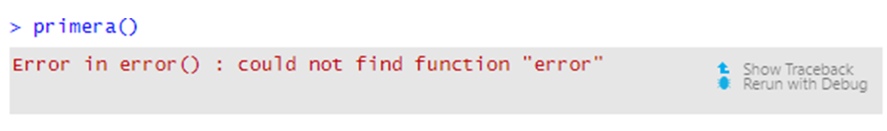
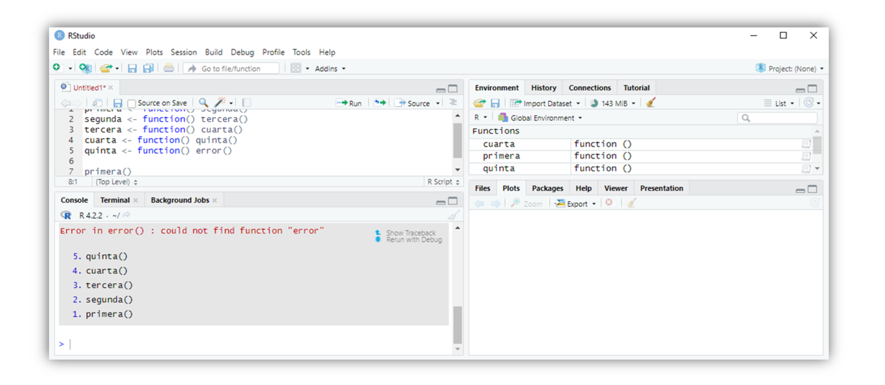
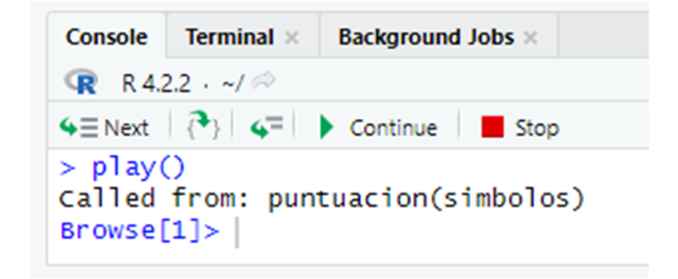
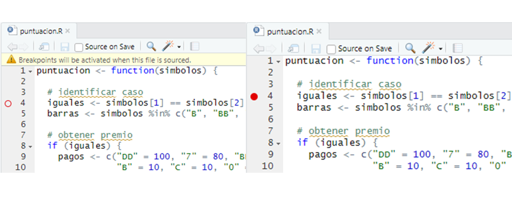

# Depuración de Código de R {#debug}

```{block2, type = "rmdnote"}
Este apéndice hace referencia a los entornos, el tema de [Entornos](#environment) y utiliza ejemplos de [Programas](#programs) y [S3](#s3). Debe leer estos capítulos primero para aprovechar al máximo este apéndice.
```

R viene con un conjunto simple de herramientas de depuración que amplifica RStudio. Puede usar estas herramientas para comprender mejor el código que produce un error o devuelve un resultado inesperado. Por lo general, este será su propio código, pero también puede examinar las funciones en R o uno de sus paquetes. 

La depuración de código puede requerir tanta creatividad y perspicacia como la escritura de código. No hay garantía de que encuentre un error o pueda solucionarlo cuando lo haga. Sin embargo, puede ayudarse usando las herramientas de depuración de R. Estas incluyen las funciones `traceback`, `browser`, `debug`, `debugonce`, `trace` y `recover`.

El uso de estas herramientas suele ser un proceso de dos pasos. Primero, localiza _dónde_ ocurrió un error. Luego intenta determinar _por qué_ ocurrió. Puede hacer el primer paso con la función `traceback` de R.

## traceback

La herramienta `traceback` señala la ubicación de un error. Muchas funciones de R llaman a otras funciones de R, que llaman a otras funciones, y así sucesivamente. Cuando ocurre un error, es posible que no esté claro cuál de estas funciones salió mal. Consideremos un ejemplo. Las siguientes funciones se llaman entre sí, y la última función crea un error (verá por qué en un segundo):

```r
primera <- function() segunda()
segunda <- function() tercera()
tercera <- function() cuarta()
cuarta <- function() quinta()
quinta <- function() error()
```

Cuando ejecuta `primera`, llamará a `segunda`, que llamará a `tercera`, que llamará a `cuarta`, que llamará a `quinta`, que llamará a `error`, una función que no existe. Así es como se verá en la línea de comando:

```r
primera()
##  Error in quinta() : could not find function "error" 
```

El informe de error nos dice que el error ocurrió cuando R intentó ejecutar `quinta`. También nos dice la naturaleza del error (no existe una función llamada `error`). Aquí, es obvio por qué R llama a `quinta`, pero podría no ser tan obvio por qué R llama a una función cuando ocurre un error en la naturaleza. 

Puede ver la ruta de las funciones que R llamó antes de que se produjera un error escribiendo *`traceback()`* en la línea de comando. `traceback` devolverá una pila de llamadas, una lista de las funciones que R llamó en el orden en que las llamó. La función inferior será el comando que ingresó en la línea de comando. La función superior será la función que causó el error:

```r
traceback()
## 5: quinta() at #1
## 4: cuarta() at #1
## 3: tercera() at #1
## 2: segunda() at #1
## 1: primera()
```

`traceback` siempre se referirá al último error que encontró. Si desea ver un error menos reciente, deberá volver a crearlo antes de ejecutar `traceback`.

¿Cómo puede ayudarte esto? Primero, `traceback` devuelve una lista de sospechosos. Una de estas funciones causó el error, y cada función es más sospechosa que las que están debajo. Lo más probable es que nuestro error provenga de `quinta` (lo hizo), pero también es posible que una función anterior haya hecho algo extraño, como llamar a `quinta` cuando no debería haberlo hecho.

En segundo lugar, `traceback` puede mostrarle si R se salió del camino que esperaba que tomara. Si esto sucedió, mire la última función antes de que las cosas salieran mal.

En tercer lugar, `traceback` puede revelar el alarmante alcance de los infinitos errores de recurrencia. Por ejemplo, si cambia `quinta` para que llame a `segunda`, las funciones harán un bucle: `segunda` llamará a `tercera`, que llamará a `cuarta`, que llamará a `quinta`, que llamará a `segunda` y comienza el bucle de nuevo. Es más fácil hacer este tipo de cosas en la práctica de lo que piensas:

```r
quinta <- function() segunda()
```

Cuando llamas a `primera()`, R comenzará a ejecutar las funciones. Después de un tiempo, notará que se está repitiendo y devolverá un error. `traceback` mostrará exactamente lo que estaba haciendo R:

```r
primera()
## Error: evaluation nested too deeply: infinite recursion/options(expressions=)?

traceback()
## 5000: cuarta() at #1
## 4999: tercera() at #1
## 4998: segunda() at #1
## 4997: quinta() at #1
## 4996: cuarta() at #1
## 4995: tercera() at #1
## 4994: segunda() at #1
## 4993: quinta() at #1
## ...
```

Observe que hay 5.000 líneas de salida en este `traceback`. Si está utilizando RStudio, no podrá ver el seguimiento de un error de recursión infinita (utilicé la GUI de Mac para obtener este resultado). RStudio reprime el rastreo de errores de recurrencia infinitos para evitar que las grandes pilas de llamadas saquen el historial de su consola del búfer de memoria de R. Con RStudio, deberá reconocer el error de recurrencia infinita por su mensaje de error. Sin embargo, aún puede ver el imponente `traceback` al ejecutar las cosas en un shell de UNIX o en las GUI de Windows o Mac.

RStudio hace que sea muy fácil usar `traceback`. Ni siquiera necesita escribir el nombre de la función. Siempre que ocurra un error, RStudio lo mostrará en un cuadro gris con dos opciones. El primero es Show Traceback, que se muestra en la Figura \@ref(fig:show-traceback). 

```{r show-traceback, echo = FALSE, fig.cap = "Opción de Show Traceback de RStudio."}

```

Si hace clic en Show Traceback, RStudio expandirá el cuadro gris y mostrará la pila de llamadas `traceback`, como en la figura \@ref(fig:hide-traceback). La opción Show Traceback persistirá junto a un mensaje de error en su consola, incluso mientras escribe nuevos comandos. Esto significa que puede volver atrás y buscar en las pilas de llamadas todos los errores, no solo el error más reciente.

Imagina que has usado `traceback` para identificar una función que crees que podría causar un error. Ahora, ¿qué debes hacer? Debe intentar averiguar qué hizo la función para causar un error mientras se ejecutaba (si es que hizo algo). Puede examinar cómo se ejecuta la función con `browser`.

```{r hide-traceback, echo = FALSE, fig.cap = "Pantalla de traceback de RStudio."}

```

## browser

Puede pedirle a R que haga una pausa en medio de la ejecución de una función y le devuelva el control con `browser`. Esto le permitirá ingresar nuevos comandos en la línea de comandos. El entorno activo para estos comandos no será el entorno global (como es habitual); será el entorno de tiempo de ejecución de la función que ha pausado. Como resultado, puede ver los objetos que usa la función, buscar sus valores con las mismas reglas de alcance que usaría la función y ejecutar el código en las mismas condiciones en las que lo haría la función. Esta disposición proporciona la mejor oportunidad para detectar la fuente de errores en una función.

Para usar `browser`, agregue la llamada `browser()` al cuerpo de una función y luego vuelva a guardar la función. Por ejemplo, si quisiera hacer una pausa en medio de la función `puntuación` de [Programas](#programs), podría agregar `browser()` al cuerpo de `puntuación` y luego volver a ejecutar el siguiente código, que define `puntuación`:

```r
puntuación <- function(simbolos) {
  # identificar caso
  iguales <- simbolos[1] == simbolos[2] && simbolos[2] == simbolos[3]
  barras <- simbolos %in% c("B", "BB", "BBB")
  
  # obtener premio
  if (iguales) {
    pagos <- c("DD" = 100, "7" = 80, "BBB" = 40, "BB" = 25, 
      "B" = 10, "C" = 10, "0" = 0)
    premio <- unname(pagos[simbolos[1]])
  } else if (all(barras)) {
    premio <- 5
  } else {
    cerezas <- sum(simbolos == "C")
    premio <- c(0, 2, 5)[cerezas + 1]
  }
  
  browser()

  # ajustar para diamantes
  diamantes <- sum(simbolos == "DD")
  premio * 2 ^ diamantes
}
```

Ahora, siempre que R ejecute `puntuacion`, llegará a la llamada `browser()`. Puede ver esto con la función `play` de [Programas](#programs) y [S3](#s3). Si no tiene `play` a mano, puede acceder ejecutando este código: 

```r
obt_simbolos() <- function() {
  rueda <- c("DD", "7", "BBB", "BB", "B", "C", "0")
  sample(rueda, size = 3, replace = TRUE, 
    prob = c(0.03, 0.03, 0.06, 0.1, 0.25, 0.01, 0.52))
}

play <- function() {
  simbolos <- obt_simbolos()
  structure(puntuacion(simbolos), simbolos = simbolos, class = "tragamonedas")
}
```

Cuando ejecutas `play`, `play` llamará a `obt_simbolos` y luego a `puntuacion`. A medida que R trabaja a través de `puntuacion`, encontrará la llamada a `browser` y la ejecutará. Cuando R ejecuta esta llamada, sucederán varias cosas, como en la Figura \@ref(fig:browser). Primero, R dejará de ejecutar `puntuacion`. En segundo lugar, el símbolo del sistema cambiará a `browser[1]>` y R me devolverá el control; Ahora puedo escribir nuevos comandos en el nuevo símbolo del sistema. En tercer lugar, aparecerán tres botones sobre el panel de la consola: Next, Continue y Stop. En cuarto lugar, RStudio mostrará el código fuente de `puntuacion` en el panel de secuencias de comandos y resaltará la línea que contiene `browser()`. Quinto, la pestaña de entornos cambiará. En lugar de revelar los objetos que se guardan en el entorno global, revelará los objetos que se guardan en el entorno de tiempo de ejecución de `puntuacion` (consulte [Entornos](#environment) para obtener una explicación del sistema de entorno de R). En sexto lugar, RStudio abrirá un nuevo panel de seguimiento, que muestra la pila de llamadas que tomó RStudio para llegar al `browser`. Se resaltará la función más reciente, `puntuacion`.

Ahora estoy en un nuevo modo de R, llamado _modo navegador_. El modo de navegador está diseñado para ayudarlo a descubrir errores, y la nueva pantalla en RStudio está diseñada para ayudarlo a navegar en este modo. 

Cualquier comando que ejecute en modo navegador se evaluará en el contexto del entorno de tiempo de ejecución de la función que llamó `browser`. Esta será la función que se resaltará en el nuevo panel Rastreo. Aquí, esa función es `puntuacion`. Entonces, mientras estamos en modo navegador, el entorno activo será el entorno de tiempo de ejecución de `puntuacion`. Esto le permite hacer dos cosas.

```{r browser, echo = FALSE, fig.cap = "RStudio actualiza su pantalla cada vez que ingresa al modo de navegador para ayudarlo a navegar por el modo."}
knitr::include_graphics("images/hopr_ae03.png")
```

Primero, puedes inspeccionar los objetos que usa `puntuacion`. El panel Entornos actualizado le muestra qué objetos `puntuacion` ha guardado en su entorno local. Puede inspeccionar cualquiera de ellos escribiendo su nombre en el indicador del navegador. Esto le brinda una manera de ver los valores de las variables de tiempo de ejecución a las que normalmente no podría acceder. Si un valor parece claramente incorrecto, es posible que esté cerca de encontrar un error:

```r
Browse[1]> simbolos
## [1] "B" "B" "0"

Browse[1]> iguales
## [1] FALSE
```

En segundo lugar, puede ejecutar el código y ver los mismos resultados que vería `puntuacion`. Por ejemplo, puede ejecutar las líneas restantes de la función `puntuacion` y ver si hacen algo inusual. Puede ejecutar estas líneas escribiéndolas en la línea de comandos, o puede usar los tres botones de navegación que ahora aparecen encima de la línea de comandos, como en la Figura \@ref(fig:browser-buttons).

El primer botón, Next, ejecutará la siguiente línea de código en `puntuacion`. La línea resaltada en el panel de secuencias de comandos avanzará una línea para mostrarle su nueva ubicación en la función `puntuacion`. Si la siguiente línea comienza con un fragmento de código, como un bucle `for` o un árbol `if`, R ejecutará el fragmento completo y lo resaltará en la ventana del script. 

El segundo botón, Continue, ejecutará todas las líneas restantes de `puntuacion` y luego saldrá del modo de navegador.

El tercer botón, Stop, saldrá del modo navegador sin ejecutar más líneas de `puntuacion`.

```{r browser-buttons, echo = FALSE, fig.cap = "Puede navegar en modo navegador con los tres botones en la parte superior del panel de la consola."}

```

Puede hacer lo mismo escribiendo los comandos `n`, `c` y `Q` en el indicador del navegador. Esto crea una molestia: ¿qué sucede si desea buscar un objeto llamado `n`, `c` o `Q`? Escribir el nombre del objeto no funcionará, R avanzará, continuará o saldrá del modo de navegador. En su lugar, tendrá que buscar estos objetos con los comandos `get("n")`, `get("c")` y `get("Q")`. `cont` es un sinónimo de `c` en modo navegador y `where` imprime la pila de llamadas, por lo que también tendrá que buscar estos objetos con `get`.

El modo de navegador puede ayudarlo a ver las cosas desde la perspectiva de sus funciones, pero no puede mostrarle dónde está el error. Sin embargo, el modo de navegador puede ayudarlo a probar hipótesis e investigar el comportamiento de la función. Esto suele ser todo lo que necesita para detectar y corregir un error. El modo de navegador es la herramienta de depuración básica de R. Cada una de las siguientes funciones solo proporciona una forma alternativa de ingresar al modo de navegador.

Una vez que solucione el error, debe volver a guardar su función por tercera vez, esta vez sin la llamada `browser()`. Siempre que la llamada del navegador esté allí, R se detendrá cada vez que usted, u otra función, llame a `puntuacion`.

## Puntos de Ruptura

Los puntos de ruptura de RStudio proporcionan una forma gráfica de agregar una declaración de `browser` a una función. Para usarlos, abra el script donde ha definido una función. Luego haga clic a la izquierda del número de línea de la línea de código en el cuerpo de la función donde le gustaría agregar la declaración de `browser`. Aparecerá un punto rojo hueco para mostrarle dónde se producirá el punto de ruptura. Luego ejecute el script haciendo clic en el botón Source en la parte superior del panel de Scripts. El punto hueco se convertirá en un punto rojo sólido para mostrar que la función tiene un punto de ruptura (vea la Figura \@ref(fig:break-point)).

R tratará el punto de interrupción como una declaración de `browser`, entrando en modo navegador cuando lo encuentre. Puede eliminar un punto de ruptura haciendo clic en el punto rojo. El punto desaparecerá y el punto de ruptura se eliminará.

```{r break-point, echo = FALSE, fig.cap = "Los puntos de ruptura proporcionan el equivalente gráfico de una declaración de browser."}

```

Los puntos de ruptura y el `browser` brindan una excelente manera de depurar las funciones que ha definido. Pero, ¿qué sucede si desea depurar una función que ya existe en R? Puedes hacerlo con la función `debug`.

## debug

Puede "agregar" una llamada del navegador al comienzo de una función preexistente con `debug`. Para hacer esto, ejecute `debug` en la función. Por ejemplo, puede ejecutar `debug` en `sample` con:

```r
debug(sample)
```

Después, R actuará como si hubiera una instrucción `browser()` en la primera línea de la función. Cada vez que R ejecute la función, ingresará inmediatamente al modo de navegador, lo que le permitirá recorrer la función una línea a la vez. R continuará comportándose de esta manera hasta que "elimine" la declaración del navegador con `undebug`:

```r
undebug(sample)
```

Puede verificar si una función está en modo de "depuración" con `isdebugged`. Esto devolverá `TRUE` si ejecutó `debug` en la función pero aún no ha ejecutado `undebug`:

```r
isdebugged(sample)
## FALSE
```

Si todo esto es demasiado complicado, puede hacer lo que yo hago y usar `debugonce` en lugar de `debug`. R ingresará al modo de navegador la próxima vez que ejecute la función, pero automáticamente eliminará la depuración de la función después. Si necesita volver a navegar por la función, puede ejecutar `debugonce` en ella por segunda vez.

Puede recrear `debugonce` en RStudio siempre que ocurra un error. Aparecerá "Reejecutar con depuración" en el cuadro de error gris debajo de Show Traceback (Figura \@ref(fig:show-traceback)). Si hace clic en esta opción, RStudio volverá a ejecutar el comando como si primero hubiera ejecutado `debugonce` en él. R entrará inmediatamente en el modo de navegador, lo que le permitirá recorrer el código. El comportamiento del navegador solo ocurrirá en esta ejecución del código. No necesita preocuparse por llamar a `undebug` cuando haya terminado.


## trace

Puede agregar la declaración del navegador más adelante en la función, y no al principio, con `trace`. `trace` toma el nombre de una función como una cadena de caracteres y luego una expresión R para insertarla en la función. También puede proporcionar un argumento `at` que le diga a `trace` en qué línea de la función colocar la expresión. Entonces, para insertar una llamada del navegador en la cuarta línea de `sample`, ejecutaría:

```r
trace("sample", browser, at = 4)
```

Puede usar `trace` para insertar otras funciones de R (no solo `browser`) en una función, pero es posible que deba pensar en una razón inteligente para hacerlo. También puede ejecutar `trace` en una función sin insertar ningún código nuevo. R imprimirá `trace:<the function>` en la línea de comando cada vez que R ejecute la función. Esta es una excelente manera de probar una afirmación que hice en [S3](#s3), que R llama a `print` cada vez que muestra algo en la línea de comando:

```r
trace(print)

primera
## trace: print(function () segunda())
## function() segunda()

head(mazo)
## trace: print
##    cara  palo valor
## 1   rey picas    13
## 2 reina picas    12
## 3  jota picas    11
## 4  diez picas    10
## 5 nueve picas     9
## 6  ocho picas     8
```

Puede revertir una función a la normalidad después de llamar a trace con `untrace`:

```r
untrace(sample)
untrace(print)
```

## recover

La función `recover` proporciona una opción final para la depuración. Combina la pila de llamadas de `traceback` con el modo de navegador de `browser`. Puedes usar `recover` como `browser`, insertándolo directamente en el cuerpo de una función. Demostremos `recover` con la función `quinta`:

```r
quinta <- function() recover()
```

Cuando R ejecuta `recover`, hará una pausa y mostrará la pila de llamadas, pero eso no es todo. R te da la opción de abrir un modo navegador en _cualquiera_ de las funciones que aparecen en la pila de llamadas. De manera molesta, la pila de llamadas se mostrará al revés en comparación con `traceback`. La función más reciente estará en la parte inferior y la función original estará en la parte superior:

```r
primera()
## 
## Enter a frame number, or 0 to exit   
## 
## 1: primera()
## 2: #1: segunda()
## 3: #1: tercera()
## 4: #1: cuarta()
## 5: #1: quinta()
```

Para entrar en un modo de navegador, escriba el número junto a la función en cuyo entorno de tiempo de ejecución le gustaría navegar. Si no desea navegar por ninguna de las funciones, escriba `0`:

```r
3
## Selection: 3
## Called from: cuarta()
## Browse[1]> 
```

A continuación, puede proceder con normalidad. `recover` le brinda la oportunidad de inspeccionar variables arriba y abajo de su pila de llamadas y es una herramienta poderosa para descubrir errores. Sin embargo, agregar `recover` al cuerpo de una función R puede ser engorroso. La mayoría de los usuarios de R lo usan como una opción global para manejar errores.

Si ejecuta el siguiente código, R llamará automáticamente a `recover()` cada vez que ocurra un error: 

```r
options(error = recover)
```

Este comportamiento durará hasta que cierre su sesión de R, o invierta el comportamiento llamando:

```r
options(error = NULL)
```


