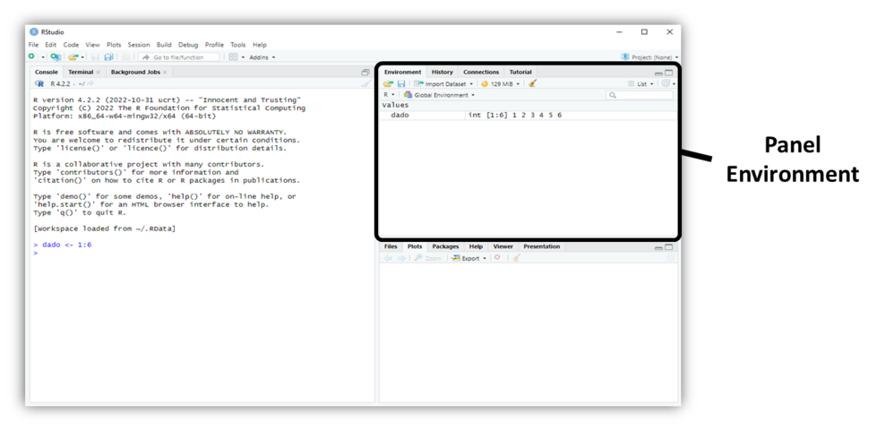
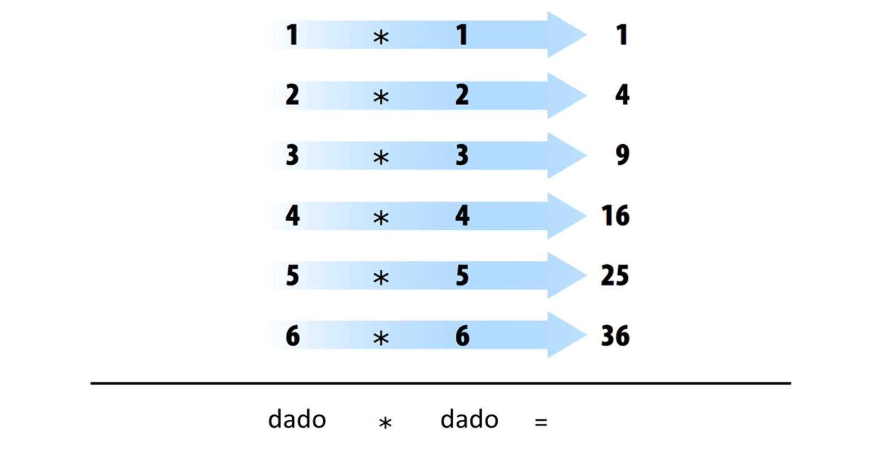
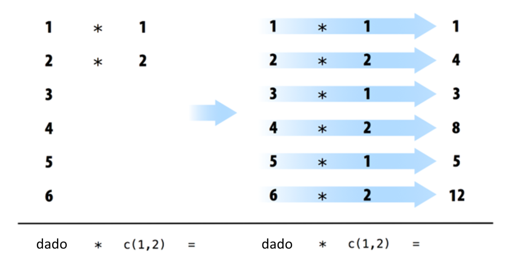
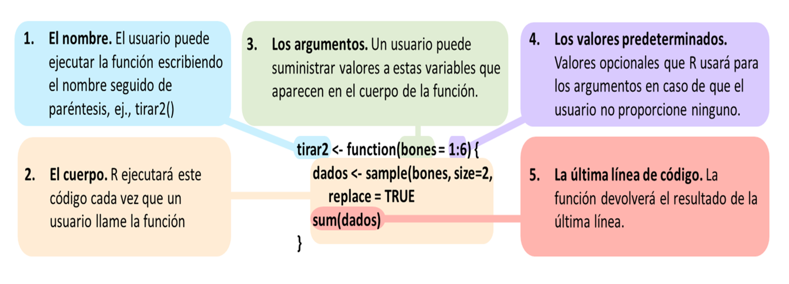
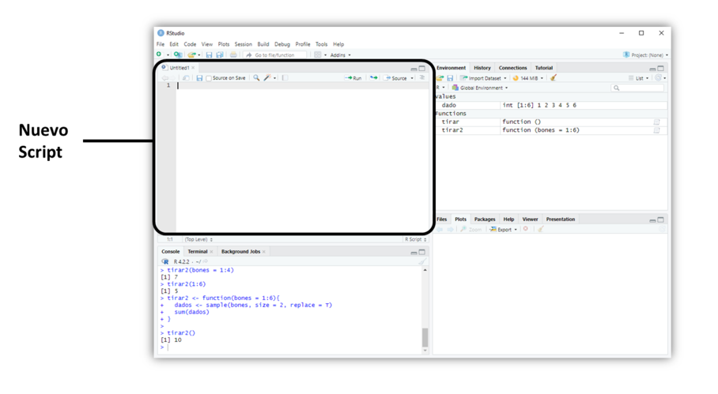
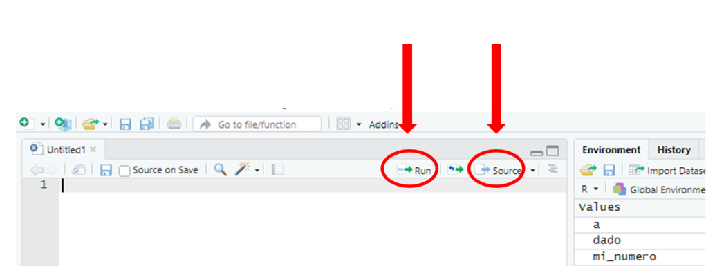

# Lo Más Básico {#Básico}

Este capítulo proporciona una descripción general amplia del lenguaje R que lo ayudará a programar de inmediato. En él, construirás un par de dados virtuales que puedes usar para generar números aleatorios. No se preocupe si nunca ha programado antes; el capítulo le enseñará todo lo que necesita saber.

Para simular un par de dados, tendrás que destilar cada dado en sus características esenciales. No puede colocar un objeto físico, como un dado, en una computadora (bueno, no sin destornillar algunos tornillos), pero puede guardar *información* sobre el objeto en la memoria de su computadora.

¿Qué información debe guardar? En general, un dado tiene seis piezas importantes de información: cuando tiras un dado, solo puede dar como resultado uno de los seis números: 1, 2, 3, 4, 5 y 6. Puedes capturar las características esenciales de un dado guardando los números 1, 2, 3, 4, 5 y 6 como un grupo de valores en la memoria de su computadora.

Trabajemos primero en guardar estos números y luego consideremos un método para "lanzar" nuestro dado.

## La Interfaz de Usuario de R

Antes de que pueda pedirle a su computadora que guarde algunos números, necesitará saber cómo hablarle. Ahí es donde entran R y RStudio. RStudio le brinda una manera de comunicarse con su computadora. R le brinda un idioma para hablar. Para comenzar, abra RStudio tal como abriría cualquier otra aplicación en su computadora. Cuando lo haga, debería aparecer una ventana en su pantalla como la que se muestra en la Figura \@ref(fig:console).

```{r console, echo = FALSE, fig.cap="Su computadora cumple con sus órdenes cuando escribe comandos R en el indicador en la línea inferior del panel de la consola. No olvides presionar la tecla Enter. Cuando abre RStudio por primera vez, la consola aparece en el panel de su izquierda, pero puede cambiar esto con File > Preferences en la barra de menú."}
knitr::include_graphics("images/hopr_0101.png")
```

```{block2, install-tip, type='rmdimportant'}
Si aún no tiene R y RStudio instalados en su computadora--o no sabe de lo que estoy hablando-- visite el [Apéndice A] (#starting). El apéndice le dará una descripción general de las dos herramientas gratuitas y le indicará cómo descargarlas.
```

La interfaz de RStudio es simple. Escriba el código R en la línea inferior del panel de la consola de RStudio y luego haga clic en Entrar para ejecutarlo. El código que escribe se llama *comando*, porque ordenará a su computadora que haga algo por usted. La línea en la que lo escribe se llama *línea de comando*.

Cuando escribe un comando en la consola y presiona Enter, su computadora ejecuta el comando y le muestra los resultados. Luego, RStudio muestra un mensaje nuevo para su próximo comando. Por ejemplo, si escribe `1 + 1` y pulsa Enter, RStudio mostrará:

    > 1 + 1
    [1] 2
    >

Notarás que aparece un `[1]` al lado de tu resultado. R solo le informa que esta línea comienza con el primer valor en su resultado. Algunos comandos devuelven más de un valor y sus resultados pueden llenar varias líneas. Por ejemplo, el comando `100:130` devuelve 31 valores; crea una secuencia de números enteros del 100 al 130. Observe que aparecen nuevos números entre corchetes al comienzo de la segunda y tercera líneas de salida. Estos números solo significan que la segunda línea comienza con el valor 14 en el resultado y la tercera línea comienza con el valor 25. En su mayoría, puede ignorar los números que aparecen entre corchetes:

    > 100:130
     [1] 100 101 102 103 104 105 106 107 108 109 110 111 112
    [14] 113 114 115 116 117 118 119 120 121 122 123 124 125
    [25] 126 127 128 129 130

```{block2, colon, type = "rmdtip"}
El operador de dos puntos (`:`) devuelve todos los números enteros entre los dos números enteros especificados antes y después de los dos puntos. Es una manera fácil de crear una secuencia de números.
```

```{block2, language, type = "rmdnote"}
**¿R no es un idioma?**

Es posible que me escuche hablar de R en tercera persona. Por ejemplo, podría decir: "Dígale a R que haga esto" o "Dígale a R que haga aquello", pero, por supuesto, R no puede hacer nada; es solo un idioma. Esta forma de hablar es una forma abreviada de decir: "Dígale a su computadora que haga esto escribiendo un comando en el lenguaje R en su consola RStudio". Su computadora, y no R, hace el trabajo real.

¿Es esta abreviatura confusa y un poco perezosa de usar? Sí. ¿Lo usa mucha gente? Todos los que conozco, probablemente porque es muy conveniente.
```

```{block2, compile, type = "rmdnote"}
**¿Cuándo compilamos?**

En algunos lenguajes, como C, Java y FORTRAN, debe compilar su código legible por humanos en un código legible por máquina (a menudo 1 y 0) antes de poder ejecutarlo. Si ha programado en un lenguaje de este tipo antes, puede preguntarse si tiene que compilar su código R antes de poder usarlo. La respuesta es no. R es un lenguaje de programación dinámico, lo que significa que R interpreta automáticamente su código a medida que lo ejecuta. 
```

Si escribe un comando incompleto y presiona Enter, R mostrará un `+` en la consola, lo que significa que R está esperando que escriba el resto de su comando. Termina el comando o presiona Escape para comenzar de nuevo:

    > 5 -
    +
    + 1
    [1] 4

Si escribe un comando que R no reconoce, R devolverá un mensaje de error. Si alguna vez ve un mensaje de error, no entre en pánico. R solo le está diciendo que su computadora no pudo entender o hacer lo que le pidió que hiciera. Luego puede probar un comando diferente en la siguiente línea:

    > 3 % 5
    Error: unexpected input in "3 % 5"
    >

Una vez que domines la línea de comando, puedes hacer fácilmente cualquier cosa en R que harías con una calculadora. Por ejemplo, podrías hacer algo de aritmética básica:

``` r
2 * 3   
## 6

4 - 1   
## 3

6 / (4 - 1)   
## 2
```

¿Notaste algo diferente en este código? He dejado fuera los `>` y `[1]`. Esto hará que el código sea más fácil de copiar y pegar si desea colocarlo en su propia consola.

R trata el carácter del hashtag, `#`, de una manera especial; R no ejecutará nada que siga a un hashtag en una línea. Esto hace que los hashtags sean muy útiles para agregar comentarios y anotaciones a su código. Los humanos podrán leer los comentarios, pero su computadora los pasará por alto. El hashtag se conoce como *símbolo de comentario* en R.

En el resto del libro, usaré hashtags para mostrar los resultados de las lineas de código R. Usaré un solo hashtag para agregar mis propios comentarios y un hashtag doble, `##`, para mostrar los resultados del código. Evitaré mostrar `>` y `[1]` a menos que quiera que los mires.

```{block2, cancelling, type = "rmdimportant"}
**Cancelar comandos**

Algunos comandos de R pueden tardar mucho tiempo en ejecutarse. Puede cancelar un comando una vez que ha comenzado presionando ctrl + c. Tenga en cuenta que R también puede tardar mucho tiempo en cancelar el comando. 
```

```{exercise, name="Magic with Numbers"}
Esa es la interfaz básica para ejecutar código R en RStudio. ¿Crees que lo tienes? Si es así, intente realizar estas sencillas tareas. Si ejecuta todo correctamente, debería terminar con el mismo número con el que comenzó:

1. Elige cualquier número y súmale 2.
2. Multiplica el resultado por 3.
3. Resta 6 de la respuesta.
4. Divide lo que obtienes por 3.
```

A lo largo del libro, pondré ejercicios en partes, como el de arriba. Seguiré cada ejercicio con una respuesta modelo, como la siguiente.

```{solution}
Puede comenzar con el número 10 y luego seguir los siguientes pasos:
```

``` r
10 + 2
## 12

12 * 3
## 36

36 - 6
## 30

30 / 3
## 10
```

## Objetos

Ahora que sabes cómo usar R, usémoslo para hacer un dado virtual. El operador `:` de hace un par de páginas le brinda una buena manera de crear un grupo de números del uno al seis. El operador `:` devuelve sus resultados como un **vector**, un conjunto unidimensional de números:

``` r
1:6
## 1 2 3 4 5 6
```

¡Eso es todo lo que hay sobre el aspecto de un dado virtual! Pero aún no has terminado. Ejecutar `1:6` generó un vector de números para que lo veas, pero no guardó ese vector en ninguna parte de la memoria de tu computadora. Lo que está viendo son básicamente las huellas de seis números que existieron brevemente y luego se fundieron de nuevo en la memoria RAM de tu computadora. Si desea volver a usar esos números, tendrá que pedirle a su computadora que los guarde en algún lugar. Puede hacerlo creando un *objeto* de R.

R le permite guardar datos almacenándolos dentro de un objeto R. ¿Qué es un objeto? Solo un nombre que puede usar para recuperar datos almacenados. Por ejemplo, puede guardar datos en un objeto como *`a`* o *`b`*. Siempre que R encuentre el objeto, lo reemplazará con los datos guardados en su interior, así:

``` r
a <- 1
a
## 1

a + 2
## 3
```

```{block2, objects, type = "rmdnote"}
**¿Qué acaba de suceder?**
  
1. Para crear un objeto R, elija un nombre y luego use el símbolo menor que, `<`, seguido de un signo menos, `-`, para guardar datos en él. Esta combinación parece una flecha, `<-`. R creará un objeto, le dará su nombre y almacenará en él lo que siga a la flecha. Entonces `a <- 1` almacena `1` en un objeto llamado `a`.
2. Cuando le preguntas a R qué hay en `a`, R te dice en la siguiente línea.
3. También puede usar su objeto en nuevos comandos R. Dado que `a` almacenó previamente el valor de `1`, ahora está agregando `1` a `2`.
```

Entonces, para otro ejemplo, el siguiente código crearía un objeto llamado `dado` que contiene los números del uno al seis. Para ver lo que está almacenado en un objeto, simplemente escriba el nombre del objeto por sí mismo:

``` r
dado <- 1:6

dado
## 1 2 3 4 5 6
```

Cuando crea un objeto, el objeto aparecerá en el panel de Environment de RStudio, como se muestra en la Figura \@ref(fig:environment). Este panel le mostrará todos los objetos que ha creado desde que abrió RStudio.

```{r, environment, echo = FALSE, fig.cap = "El panel de Environment de RStudio realiza un seguimiento de los objetos R que crea."}

```

Puedes nombrar un objeto en R casi como quieras, pero hay algunas reglas. Primero, un nombre no puede comenzar con un número. Segundo, un nombre no puede usar algunos símbolos especiales, como `^`, `!`, `$`, `@`, `+`, `-`, `/`, or `*`:

| Buenos nombres | Nombres que causan error |
|----------------|--------------------------|
| a              | 1trial                   |
| b              | \$                       |
| FOO            | \^mean                   |
| my_var         | 2nd                      |
| .day           | !bad                     |

```{block2, capitalization, type = "rmdwarning"}
**Mayúsculas**
  
R distingue entre mayúsculas y minúsculas, por lo que `nombre` y `Nombre` se referirán a diferentes objetos:

`Nombre <- 1`  
`nombre <- 0`  
  
`Nombre + 1`  
`## 2`  
```

Finalmente, R sobrescribirá cualquier información anterior almacenada en un objeto sin pedirle permiso. Por lo tanto, es una buena idea *no* usar nombres que ya están en uso:

``` r
my_number <- 1
my_number 
## 1

my_number <- 999
my_number
## 999
```

Puedes ver qué nombres de objetos ya has usado con la función `ls`:

``` r
ls()
## "a"         "dado"       "my_number" "nombre"     "Nombre"     
```

También puede ver qué nombres ha utilizado examinando el panel de environment de RStudio.

Ahora tiene un dado virtual que está almacenado en la memoria de su computadora. Puedes acceder a él cuando quieras escribiendo la palabra *`dado`*. Entonces, ¿qué puedes hacer con este dado? Bastante. R reemplazará un objeto con su contenido siempre que el nombre del objeto aparezca en un comando. Entonces, por ejemplo, puedes hacer todo tipo de operaciones matemáticas con el dado. Las matemáticas no son tan útiles para lanzar dados, pero la manipulación de conjuntos de números será su día a día como científico de datos. Así que echemos un vistazo a cómo hacer eso:

``` r
dado - 1
## 0 1 2 3 4 5

dado / 2
## 0.5 1.0 1.5 2.0 2.5 3.0

dado * dado
## 1  4  9 16 25 36
```

Si eres un gran fanático del álgebra lineal (¿y quién no lo es?), puedes notar que R no siempre sigue las reglas de la multiplicación de matrices. En su lugar, R utiliza *ejecución por elementos*. Cuando manipulas un conjunto de números, R aplicará la misma operación a cada elemento del conjunto. Entonces, por ejemplo, cuando ejecuta *`dado - 1`*, R resta uno de cada elemento de `dado`.

Cuando usa dos o más vectores en una operación, R alineará los vectores y realizará una secuencia de operaciones individuales. Por ejemplo, cuando ejecuta *`dado * dado`*, R alinea los dos vectores `dado` y luego multiplica el primer elemento del vector 1 por el primer elemento del vector 2. R luego multiplica el segundo elemento del vector 1 por el segundo elemento del vector 2, y así sucesivamente, hasta que se hayan multiplicado todos los elementos. El resultado será un nuevo vector de la misma longitud que los dos primeros, como se muestra en la Figura \@ref(fig:elementwise).

```{r elementwise, echo = FALSE, fig.cap = "Cuando R realiza una ejecución por elementos, hace coincidir los vectores y luego manipula cada par de elementos de forma independiente."}

```

Si le da a R dos vectores de longitudes desiguales, R repetirá el vector más corto hasta que sea tan largo como el vector más largo y luego hará los cálculos, como se muestra en la Figura \@ref(fig:recycle). Este no es un cambio permanente: el vector más corto tendrá su tamaño original después de que R haga los cálculos. Si la longitud del vector largo no es divisible equitativamente por el vctor corto, R devolverá un mensaje de advertencia. Este comportamiento se conoce como *reciclado de vectores* y ayuda a R a realizar operaciones por elementos:

``` r
1:2
## 1 2

1:4
## 1 2 3 4

dado
## 1 2 3 4 5 6

dado + 1:2
## 2 4 4 6 6 8

dado + 1:4
## 2 4 6 8 6 8
Warning message:
In dado + 1:4 :
  longer object length is not a multiple of shorter object length
```

```{r recycle, echo = FALSE, fig.cap = "R repetirá un vector corto para realizar operaciones por elementos con dos vectores de longitud desigual."}

```

Las operaciones basadas en elementos son una característica muy útil en R porque manipulan grupos de valores de forma ordenada. Cuando comience a trabajar con conjuntos de datos, las operaciones por elementos garantizarán que los valores de una observación o caso solo se emparejen con valores de la misma observación o caso. Las operaciones basadas en elementos también facilitan la escritura de sus propios programas y funciones en R.

Pero no creas que R ha renunciado a la multiplicación de matrices tradicional. Solo tienes que pedirlo cuando quieras. Puedes hacer multiplicaciones internas con el operador `%*%` y multiplicaciones externas con el operador `%o%`:

``` r
dado %*% dado
## 91

dado %o% dado
##      [,1] [,2] [,3] [,4] [,5] [,6]
## [1,]    1    2    3    4    5    6
## [2,]    2    4    6    8   10   12
## [3,]    3    6    9   12   15   18
## [4,]    4    8   12   16   20   24
## [5,]    5   10   15   20   25   30
## [6,]    6   12   18   24   30   36
```

También puedes hacer cosas como transponer una matriz con `t` y tomar su determinante con `det`.

No se preocupe si no está familiarizado con estas operaciones. Son fáciles de buscar y no los necesitará para este libro.

Ahora que puede hacer operaciones matemáticas con su objeto `dado`, veamos cómo podría "tirarlo". Lanzar el dado requerirá algo más sofisticado que la aritmética básica; deberá seleccionar aleatoriamente uno de los valores del dado. Y para eso, necesitarás una *función*.

## Funciones

R viene con muchas funciones que puede usar para realizar tareas sofisticadas como el muestreo aleatorio. Por ejemplo, puede redondear un número con la función `round` o calcular su factorial con la función `factorial`. Usar una función es bastante simple. Simplemente escriba el nombre de la función y luego los datos sobre los que desea que opere la función entre paréntesis::

``` r
round(3.1415)
## 3

factorial(3)
## 6
```

Los datos que pasa a la función se denominan *argumento* de la función. El argumento puede ser datos sin procesar, un objeto R o incluso los resultados de otra función R. En este último caso, R trabajará desde la función más interna hacia la más externa, como en la Figura \@ref(fig:pemdas).

``` r
mean(1:6)
## 3.5

mean(dado)
## 3.5

round(mean(dado))
## 4
```

```{r, pemdas, echo = FALSE, fig.cap = "Cuando vincula funciones, R las resolverá desde la operación más interna hasta la más externa. Aquí R primero busca el dado, luego calcula la media de uno a seis y luego redondea la media."}

```

Por suerte para nosotros, hay una función R que puede ayudar a "tirar" el dado. Puede simular una tirada del dado con la función `sample` de R. `sample` toma *dos* argumentos: un vector llamado `x` y un número llamado `size`. `sample` devolverá elementos de `size` del vector:

``` r
sample(x = 1:4, size = 2)
## 3 2
```

Para tirar el dado y obtener un número de vuelta, establezca `x` en `dado` y muestree un elemento de él. Obtendrá un número nuevo (quizás diferente) cada vez que lo haga rodar:

``` r
sample(x = dado, size = 1)
## 2

sample(x = dado, size = 1)
## 1

sample(x = dado, size = 1)
## 6
```

Muchas funciones de R toman múltiples argumentos que las ayudan a hacer su trabajo. Puede dar a una función tantos argumentos como desee siempre que separe cada argumento con una coma.

Es posible que hayas notado que establecí `dado` y `1` iguales a los nombres de los argumentos en `sample`, `x` y `size`. Cada argumento en cada función de R tiene un nombre. Puede especificar qué datos deben asignarse a qué argumento estableciendo un nombre igual a data, como en el código anterior. Esto se vuelve importante a medida que comienza a pasar múltiples argumentos a la misma función; los nombres lo ayudan a evitar pasar los datos incorrectos al argumento incorrecto. Sin embargo, el uso de nombres es opcional. Notará que los usuarios de R no suelen usar el nombre del primer argumento en una función. Por lo tanto, es posible que vea el código anterior escrito como:

``` r
sample(dado, size = 1)
## 2
```

A menudo, el nombre del primer argumento no es muy descriptivo y, de todos modos, suele ser obvio a qué se refiere el primer dato.

Pero, ¿cómo saber qué nombres de argumento usar? Si intenta usar un nombre que una función no espera, es probable que obtenga un error:

``` r
round(3.1415, corners = 2)
## Error in round(3.1415, corners = 2) : unused argument(s) (corners = 2)
```

Si no está seguro de qué nombres usar con una función, puede buscar los argumentos de la función con `args`. Para hacer esto, coloque el nombre de la función entre paréntesis detrás de `args`. Por ejemplo, puede ver que la función `round` toma dos argumentos, uno llamado `x` y otro llamado `digits`:

``` r
args(round)
## function (x, digits = 0) 
## NULL
```

¿Notaste que `args` muestra que el argumento `digits` de `round` ya está establecido en 0? Con frecuencia, una función R tomará argumentos opcionales como `digits`. Estos argumentos se consideran opcionales porque vienen con un valor predeterminado. Puede pasar un nuevo valor a un argumento opcional si así lo desea, y R utilizará el valor predeterminado si no proporciona uno nuevo. Por ejemplo, "round" redondeará su número a 0 dígitos más allá del punto decimal de forma predeterminada. Para anular el valor predeterminado, proporcione su propio valor para `digits`:

``` r
round(3.1415)
## 3

round(3.1415, digits = 2)
## 3.14
```

Debe escribir los nombres de cada argumento después del primero o dos cuando llame a una función con múltiples argumentos. ¿Por qué? Primero, esto lo ayudará a usted y a otros a comprender su código. Por lo general, es obvio a qué argumento se refiere su primera entrada (y, a veces, también la segunda entrada). Sin embargo, necesitaría una memoria grande para recordar los argumentos tercero y cuarto de cada función R. En segundo lugar, y más importante, escribir los nombres de los argumentos evita errores.

Si no escribe los nombres de sus argumentos, R hará coincidir sus valores con los argumentos de su función por orden. Por ejemplo, en el siguiente código, el primer valor, `dado`, coincidirá con el primer argumento de `sample`, que se llama `x`. El siguiente valor, `1`, coincidirá con el siguiente argumento, `size`:

``` r
sample(dado, 1)
## 2
```

A medida que proporciona más argumentos, es más probable que su orden y el orden de R no coincidan. Como resultado, los valores pueden pasarse al argumento incorrecto. Los nombres de los argumentos evitan esto. R siempre hará coincidir un valor con el nombre de su argumento, sin importar dónde aparezca en el orden de los argumentos:

``` r
sample(size = 1, x = dado)
## 2
```

### Muestra con reemplazo

Si configura `size = 2`, puede *casi* simular un par de dados. Antes de ejecutar ese código, piense por un minuto por qué ese podría ser el caso. `sample` devolverá dos números, uno para cada dado:

``` r
sample(dado, size = 2)
## 3 4
```

Dije que esto "casi" funciona porque este método hace algo divertido. Si lo usa muchas veces, notará que el segundo dado nunca tiene el mismo valor que el primero, lo que significa que nunca obtendrá algo como un par de tres o un par de unos. ¿Qué esta pasando?

Por defecto, `sample` construye una muestra *sin reemplazo*. Para ver lo que esto significa, imagina que `sample` coloca todos los valores de `dado` en un frasco o urna. Luego imagine que `sample` alcanza el frasco y extrae valores uno por uno para construir su muestra. Una vez que se ha extraído un valor del frasco, `sample` lo deja a un lado. El valor no vuelve al frasco, por lo que no se puede volver a extraer. Entonces, si `sample` selecciona un seis en su primer sorteo, no podrá seleccionar un seis en el segundo sorteo; seis ya no está en el frasco para ser seleccionado. Aunque `sample` crea su muestra electrónicamente, sigue este comportamiento aparentemente físico.

Un efecto secundario de este comportamiento es que cada sorteo depende de los sorteos anteriores. Sin embargo, en el mundo real, cuando lanzas un par de dados, cada dado es independiente del otro. Si el primer dado sale seis, no impide que el segundo dado salga seis. De hecho, no influye en el segundo dado de ninguna manera. Puede recrear este comportamiento en `sample` agregando el argumento `replace = TRUE`:

``` r
sample(dado, size = 2, replace = TRUE)
## 5 5
```

El argumento `replace = TRUE` hace que `sample` muestree *con reemplazo*. Nuestro ejemplo de frasco proporciona una buena manera de comprender la diferencia entre el muestreo con reemplazo y sin reemplazo. Cuando `sample` usa reemplazo, extrae un valor del frasco y registra el valor. Luego vuelve a poner el valor en el frasco. En otras palabras, `sample` *reemplaza* cada valor después de cada sorteo. Como resultado, `sample` puede seleccionar el mismo valor en el segundo sorteo. Cada valor tiene la posibilidad de ser seleccionado cada vez. Es como si cada sorteo fuera el primer sorteo.

El muestreo con reemplazo es una manera fácil de crear *muestras aleatorias independientes*. Cada valor en su muestra será una muestra de tamaño uno que es independiente de los otros valores. Esta es la forma correcta de simular un par de dados.

``` r
sample(dado, size = 2, replace = TRUE)
## 2 4
```

Felicítate a ti mismo; ¡Acabas de ejecutar tu primera simulación en R! Ahora tiene un método para simular el resultado de lanzar un par de dados. Si desea sumar los dados, puede ingresar su resultado directamente en la función `sum`:

``` r
dados <- sample(dado, size = 2, replace = TRUE)
dados
## 2 4

sum(dados)
## 6
```

¿Qué pasaría si llamas `dados` varias veces? ¿Generaría R un nuevo par de valores de dados cada vez? Probemos:

``` r
dados
## 2 4

dados
## 2 4

dados
## 2 4
```

No. Cada vez que llame a `dados`, R le mostrará el resultado de esa vez que llamó a `sample` y guardó la salida en `dados`. R no volverá a ejecutar `sample(dado, 2, replace = TRUE)` para crear una nueva tirada de dados. Esto es un alivio en cierto modo. Una vez que guarda un conjunto de resultados en un objeto de R, esos resultados no cambian. La programación sería bastante difícil si los valores de sus objetos cambiaran cada vez que los llama.

Sin embargo, *sería* conveniente tener un objeto que pueda volver a tirar los dados cada vez que lo llames. Puede hacer tal objeto escribiendo su propia función de R.

## Escribiendo Sus Propias Funciones {#Escribir-funciones}

Para recapitular, ya tiene un código de R en funcionamiento que simula lanzar un par de dados:

``` r
dado <- 1:6
dados <- sample(dado, size = 2, replace = TRUE)
sum(dados)
```

Puede volver a escribir este código en la consola en cualquier momento que desee volver a tirar los dados. Sin embargo, esta es una forma incómoda de trabajar con el código. Sería más fácil usar su código si lo envolviera en su propia función, que es exactamente lo que haremos ahora. Vamos a escribir una función llamada `tirar` que puedes usar para lanzar tus dados virtuales. Cuando hayas terminado, la función funcionará así: cada vez que llames a `tirar()`, R devolverá la suma de tirar dos dados:

``` r
tirar()
## 8 

tirar()
## 3

tirar()
## 7
```

Las funciones pueden parecer misteriosas o sofisticadas, pero son solo otro tipo de objeto de R. En lugar de contener datos, contienen código. Este código se almacena en un formato especial que facilita su reutilización en situaciones nuevas. Puede escribir sus propias funciones recreando este formato.

### El Constructor de Funciones

Cada función en R tiene tres partes básicas: un nombre, un cuerpo de código y un conjunto de argumentos. Para crear su propia función, debe replicar estas partes y almacenarlas en un objeto de R, esto lo puede hacer con la función `function`. Para hacer esto, llama a `function()` y sigue con un par de llaves, `{}`:

``` r
mi_funcion <- function() {}
```

`function` construirá una función a partir de cualquier código R que coloque entre las llaves. Por ejemplo, puede convertir su código de dados en una función llamando:

``` r
tirar <- function() {
  dado <- 1:6
  dados <- sample(dado, size = 2, replace = TRUE)
  sum(dados)
}
```

```{block2, indent, type = "rmdnote"}
Observe que he aplicado sangría a cada línea de código entre las llaves. Esto hace que el código sea más fácil de leer para usted y para mí, pero no tiene impacto en cómo se ejecuta el código. R ignora los espacios y los saltos de línea y ejecuta una expresión completa a la vez.
```

Simplemente presione la tecla Enter entre cada línea después de la primera llave, `{`. R esperará a que escribas la última llave, `}`, antes de responder.

No olvide guardar la salida de `function` en un objeto de R. Este objeto se convertirá en su nueva función. Para usarlo, escriba el nombre del objeto seguido de un paréntesis de apertura y cierre:

``` r
tirar()
## 9
```

Puede pensar en los paréntesis como el "disparador" que hace que R ejecute la función. Si escribe el nombre de una función *sin* los paréntesis, R le mostrará el código que está almacenado dentro de la función. Si escribe el nombre *con* los paréntesis, R ejecutará ese código:

``` r
tirar
## function() {
##   dado <- 1:6
##   dados <- sample(dado, size = 2, replace = TRUE)
##   sum(dados)
## }

tirar()
## 6
```

El código que coloca dentro de su función se conoce como el *cuerpo* de la función. Cuando ejecuta una función en R, R ejecutará todo el código en el cuerpo y luego devolverá el resultado de la última línea de código. Si la última línea de código no devuelve un valor, tampoco lo hará su función, por lo que debe asegurarse de que su última línea de código devuelva un valor. Una forma de verificar esto es pensar en lo que sucedería si ejecutara el cuerpo del código línea por línea en la consola. ¿Mostraría R un resultado después de la última línea, o no?

Aquí hay un código que mostraría un resultado:

``` r
dados
1 + 1
sqrt(2)
```

Y aquí hay un código que no:

``` r
dados <- sample(dado, size = 2, replace = TRUE)
dos <- 1 + 1
a <- sqrt(2)
```

¿Notas el patrón? Estas líneas de código no devuelven un valor a la línea de comando; guardan un valor a un objeto.

## Argumentos

What if we removed one line of code from our function and changed the name `die` to `bones`, like this?

``` r
roll2 <- function() {
  dice <- sample(bones, size = 2, replace = TRUE)
  sum(dice)
}
```

Now I'll get an error when I run the function. The function needs the object `bones` to do its job, but there is no object named `bones` to be found:

``` r
roll2()
## Error in sample(bones, size = 2, replace = TRUE) : 
##   object 'bones' not found
```

You can supply `bones` when you call `roll2` if you make `bones` an argument of the function. To do this, put the name `bones` in the parentheses that follow `function` when you define `roll2`:

``` r
roll2 <- function(bones) {
  dice <- sample(bones, size = 2, replace = TRUE)
  sum(dice)
}
```

Now `roll2` will work as long as you supply `bones` when you call the function. You can take advantage of this to roll different types of dice each time you call `roll2`. Dungeons and Dragons, here we come!

Remember, we're rolling pairs of dice:

``` r
roll2(bones = 1:4)
##  3

roll2(bones = 1:6)
## 10

roll2(1:20)
## 31
```

Notice that `roll2` will still give an error if you do not supply a value for the `bones` argument when you call `roll2`:

``` r
roll2()
## Error in sample(bones, size = 2, replace = TRUE) : 
##   argument "bones" is missing, with no default
```

You can prevent this error by giving the `bones` argument a default value. To do this, set `bones` equal to a value when you define `roll2`:

``` r
roll2 <- function(bones = 1:6) {
  dice <- sample(bones, size = 2, replace = TRUE)
  sum(dice)
}
```

Now you can supply a new value for `bones` if you like, and `roll2` will use the default if you do not:

``` r
roll2()
## 9
```

You can give your functions as many arguments as you like. Just list their names, separated by commas, in the parentheses that follow `function`. When the function is run, R will replace each argument name in the function body with the value that the user supplies for the argument. If the user does not supply a value, R will replace the argument name with the argument's default value (if you defined one).

To summarize, `function` helps you construct your own R functions. You create a body of code for your function to run by writing code between the braces that follow `function`. You create arguments for your function to use by supplying their names in the parentheses that follow `function`. Finally, you give your function a name by saving its output to an R object, as shown in Figure \@ref(fig:functions).

Once you've created your function, R will treat it like every other function in R. Think about how useful this is. Have you ever tried to create a new Excel option and add it to Microsoft's menu bar? Or a new slide animation and add it to Powerpoint's options? When you work with a programming language, you can do these types of things. As you learn to program in R, you will be able to create new, customized, reproducible tools for yourself whenever you like. [Project 3: Slot Machine](#slots) will teach you much more about writing functions in R.

```{r functions, echo = FALSE, fig.cap = "Every function in R has the same parts, and you can use function to create these parts. Assign the result to a name, so you can call the function later."}

```

## Scripts

What if you want to edit `roll2` again? You could go back and retype each line of code in `roll2`, but it would be so much easier if you had a draft of the code to start from. You can create a draft of your code as you go by using an R *script*. An R script is just a plain text file that you save R code in. You can open an R script in RStudio by going to `File > New File > R script` in the menu bar. RStudio will then open a fresh script above your console pane, as shown in Figure \@ref(fig:script).

I strongly encourage you to write and edit all of your R code in a script before you run it in the console. Why? This habit creates a reproducible record of your work. When you're finished for the day, you can save your script and then use it to rerun your entire analysis the next day. Scripts are also very handy for editing and proofreading your code, and they make a nice copy of your work to share with others. To save a script, click the scripts pane, and then go to `File > Save As` in the menu bar.

```{r script, echo = FALSE, fig.cap = "When you open an R Script (File > New File > R Script in the menu bar), RStudio creates a fourth pane above the console where you can write and edit your code."}

```

RStudio comes with many built-in features that make it easy to work with scripts. First, you can automatically execute a line of code in a script by clicking the Run button, as shown in Figure \@ref(fig:run).

R will run whichever line of code your cursor is on. If you have a whole section highlighted, R will run the highlighted code. Alternatively, you can run the entire script by clicking the Source button. Don't like clicking buttons? You can use Control + Return as a shortcut for the Run button. On Macs, that would be Command + Return.

```{r run, echo = FALSE, fig.cap = "You can run a highlighted portion of code in your script if you click the Run button at the top of the scripts pane. You can run the entire script by clicking the Source button."}

```

If you're not convinced about scripts, you soon will be. It becomes a pain to write multi-line code in the console's single-line command line. Let's avoid that headache and open your first script now before we move to the next chapter.

```{block2, extract, type = "rmdtip"}
**Extract function**

RStudio comes with a tool that can help you build functions. To use it, highlight the lines of code in your R script that you want to turn into a function. Then click `Code > Extract Function` in the menu bar. RStudio will ask you for a function name to use and then wrap your code in a `function` call. It will scan the code for undefined variables and use these as arguments.

You may want to double-check RStudio's work. It assumes that your code is correct, so if it does something surprising, you may have a problem in your code.
```

## Summary

You've covered a lot of ground already. You now have a virtual die stored in your computer's memory, as well as your own R function that rolls a pair of dice. You've also begun speaking the R language.

As you've seen, R is a language that you can use to talk to your computer. You write commands in R and run them at the command line for your computer to read. Your computer will sometimes talk back--for example, when you commit an error--but it usually just does what you ask and then displays the result.

The two most important components of the R language are objects, which store data, and functions, which manipulate data. R also uses a host of operators like `+`, `-`, `*`, `/`, and `<-` to do basic tasks. As a data scientist, you will use R objects to store data in your computer's memory, and you will use functions to automate tasks and do complicated calculations. We will examine objects in more depth later in [Project 2: Playing Cards] and dig further into functions in [Project 3: Slot Machine]. The vocabulary you have developed here will make each of those projects easier to understand. However, we're not done with your dice yet.

In [Packages and Help Pages](#packages), you'll run some simulations on your dice and build your first graphs in R. You'll also look at two of the most useful components of the R language: R *packages*, which are collections of functions writted by R's talented community of developers, and R documentation, which is a collection of help pages built into R that explains every function and data set in the language.
