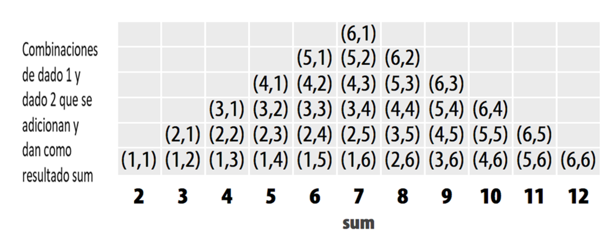
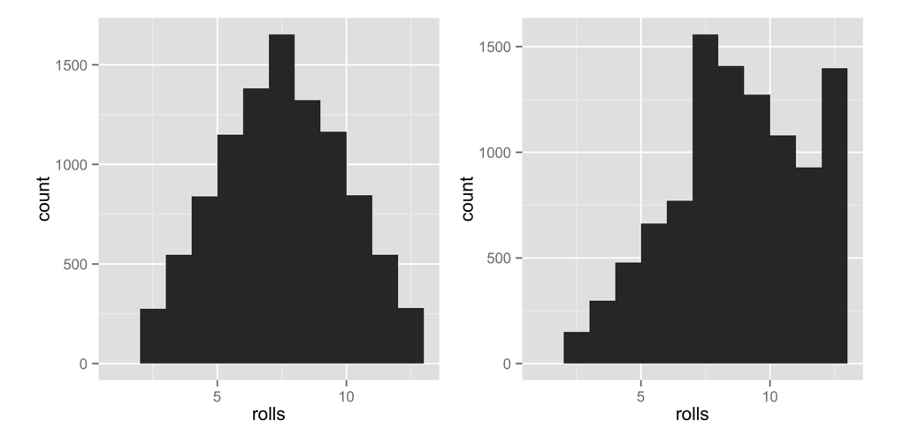

# Paquetes y páginas de ayuda {#packages}

Ahora tiene una función que simula lanzar un par de dados. Hagamos las cosas un poco más interesantes ponderando los dados a tu favor. La casa siempre gana, ¿verdad? Hagamos que los dados arrojen números altos un poco más a menudo que los números bajos. 

Antes de ponderar los dados, debemos asegurarnos de que sean justos para empezar. Dos herramientas te ayudarán a hacer esto: _repetición_ y _visualización_. Por coincidencia, estas herramientas también son dos de los superpoderes más útiles en el mundo de la ciencia de datos. 

Repetiremos nuestras tiradas de dados con una función llamada `replicate` y visualizaremos nuestras tiradas con una función llamada `qplot`. `qplot` no viene con R cuando lo descargas; `qplot` viene en un paquete de R independiente. Muchas de las herramientas de R más útiles vienen en paquetes de R, así que tomemos un momento para ver qué son los paquetes de R y cómo puede usarlos.

## Paquetes

No es la única persona que escribe sus propias funciones con R. Muchos profesores, programadores y estadísticos usan R para diseñar herramientas que pueden ayudar a las personas a analizar datos. Luego hacen que estas herramientas sean gratuitas para que cualquiera las use. Para usar estas herramientas, solo tienes que descargarlas. Vienen como colecciones preensambladas de funciones y objetos llamados paquetes. [Apéndice 2: Paquetes de R](#packages2) contiene instrucciones detalladas para descargar y actualizar paquetes R, pero aquí veremos los conceptos básicos.

Vamos a usar la función `qplot` para hacer algunos gráficos rápidos. `qplot` viene en el paquete _ggplot2_, un paquete popular para hacer gráficos. Antes de que pueda usar `qplot`, o cualquier otra cosa en el paquete ggplot2, debe descargarlo e instalarlo.

### install.packages

Cada paquete R está alojado en [http://cran.r-project.org](http://cran.r-project.org), el mismo sitio web que aloja R. Sin embargo, no necesita visitar el sitio web para descargar un paquete R; puede descargar paquetes directamente desde la línea de comandos de R. Así es cómo: 

* Abre RStudio.
* Asegúrate de estar conectado a Internet.
* Ejecute *`install.packages("ggplot2")`* en la línea de comando.

Eso es. R hará que su computadora visite el sitio web, descargue ggplot2 e instale el paquete en su disco duro justo donde R quiere encontrarlo. Ahora tiene el paquete ggplot2. Si desea instalar otro paquete, reemplace ggplot2 con el nombre de su paquete en el código.

### library

La instalación de un paquete no pone sus funciones al alcance de su mano todavía: simplemente las coloca en su disco duro. Para usar un paquete de R, luego debe cargarlo en su sesión de R con el comando *`library("ggplot2")`*. Si desea cargar un paquete diferente, reemplace ggplot2 con el nombre de su paquete en el código.

Para ver lo que esto hace, intente un experimento. Primero, pide a R que te muestre la función `qplot`. R no podrá encontrar `qplot` porque `qplot` vive en el paquete ggplot2, que no ha cargado:

```r
qplot
## Error: object 'qplot' not found
```

Ahora cargue el paquete ggplot2:

```r
library("ggplot2")
```

Si instaló el paquete con `install.packages` según las instrucciones, todo debería ir bien. No se preocupe si no ve ningún resultado o mensaje. No tener noticias es una buena noticia a la hora de cargar un paquete. No se preocupe si ve un mensaje tampoco; ggplot2 a veces muestra mensajes de inicio útiles. Mientras no vea nada que diga "Error", lo está haciendo bien.

Ahora, si pide ver `qplot`, R le mostrará bastante código (`qplot` es una función larga):

```r
qplot
## (quite a bit of code)
```

[Apéndice 2: Paquetes de R](#packages2) contiene muchos más detalles sobre la adquisición y el uso de paquetes. Le recomiendo que lo lea si no está familiarizado con el sistema de paquetes de R. Lo más importante que debe recordar es que solo necesita instalar un paquete una vez, pero debe cargarlo con `library` cada vez que desee usarlo en una nueva sesión de R. R descargará todos sus paquetes cada vez que cierre RStudio.

Ahora que ha cargado `qplot`, vamos a probarlo. `qplot` hace "gráficos rápidos". Si le das a `qplot` dos vectores de igual longitud, `qplot` dibujará un diagrama de dispersión por ti. `qplot` usará el primer vector como un conjunto de valores x y el segundo vector como un conjunto de valores y. Busque el gráfico que aparecerá en la pestaña Gráficos del panel inferior derecho de la ventana de RStudio. 

El siguiente código creará el gráfico que aparece en la Figura \@ref(fig:qplot). Hasta ahora, hemos estado creando secuencias de números con el operador `:`; pero también puedes crear vectores de números con la función `c`. Proporcione a `c` todos los números que desea que aparezcan en el vector, separados por una coma. `c` significa _concatenar_, pero puedes pensar en ello como "recolectar" o "combinar":

```r
x <- c(-1, -0.8, -0.6, -0.4, -0.2, 0, 0.2, 0.4, 0.6, 0.8, 1)
x
## -1.0 -0.8 -0.6 -0.4 -0.2  0.0  0.2  0.4  0.6  0.8  1.0

y <- x^3
y
## -1.000 -0.512 -0.216 -0.064 -0.008  0.000  0.008
##  0.064  0.216  0.512  1.000

qplot(x, y)
```

```{r qplot, echo = FALSE, fig.cap = "qplot hace un diagrama de dispersión cuando le das dos vectores."}
knitr::include_graphics("images/hopr_0201.png")
```

No necesitas nombrar tus vectores `x` e `y`. Solo hice eso para aclarar el ejemplo. Como puede ver en la figura \@ref(fig:qplot), un diagrama de dispersión es un conjunto de puntos, cada uno representado de acuerdo con sus valores x e y. Juntos, los vectores `x` e `y` describen un conjunto de 10 puntos. ¿Cómo hizo coincidir R los valores en `x` e `y` para hacer estos puntos? Con ejecución por elementos, como vimos en la Figura \@ref(fig:elementwise).

Los diagramas de dispersión son útiles para visualizar la relación entre dos variables. Sin embargo, vamos a utilizar un tipo diferente de gráfico, un _histograma_. Un histograma visualiza la distribución de una sola variable; muestra cuántos puntos de datos aparecen en cada valor de x. 

Echemos un vistazo a un histograma para ver si esto tiene sentido. `qplot` hará un histograma cada vez que le des solo _un_ vector para graficar. El siguiente código crea el gráfico de la izquierda en la Figura \@ref(fig:hist) (nos preocuparemos del gráfico de la derecha en un segundo). Para asegurarse de que nuestros gráficos tengan el mismo aspecto, utilice el argumento extra *`binwidth = 1`*:

```r
x <- c(1, 2, 2, 2, 3, 3)
qplot(x, binwidth = 1)
```

```{r hist, echo = FALSE, fig.cap = "qplot hace un histograma cuando le das un solo vector."}
knitr::include_graphics("images/hopr_0202.png")
```

Este gráfico muestra que nuestro vector contiene un valor en el intervalo `[1, 2)` colocando una barra de altura 1 sobre ese intervalo. De manera similar, la gráfica muestra que el vector contiene tres valores en el intervalo `[2, 3)` colocando una barra de altura 3 en ese intervalo. Muestra que el vector contiene dos valores en el intervalo `[3, 4)` colocando una barra de altura 2 en ese intervalo. En estos intervalos, el corchete, `[`, significa que el primer número está incluido en el intervalo. El paréntesis, `)`, significa que el último número _no_ está incluido.

Probemos con otro histograma. Este código crea el gráfico de la derecha en la Figura \@ref(fig:hist). Observe que hay cinco puntos con un valor de 1 en `x2`. El histograma muestra esto trazando una barra de altura 5 sobre el intervalo x2 = [1, 2):

```r
x2 <- c(1, 1, 1, 1, 1, 2, 2, 2, 2, 3, 3, 4)
qplot(x2, binwidth = 1)
```

```{exercise, name = "Visualizar un histograma"}
Sea `x3` el siguiente vector:
```

`x3 <- c(0, 1, 1, 2, 2, 2, 3, 3, 4)`

Imagina cómo se vería un histograma de `x3`. Suponga que el histograma tiene un ancho de intervalo de 1. ¿Cuántas barras tendrá el histograma? ¿Dónde aparecerán? ¿Qué altura tendrá cada uno?

Cuando haya terminado, trace un histograma de `x3` con `binwidth = 1`, y vea si tiene razón.


```{solution}
Puedes hacer un histograma de `x3` con `qplot(x3, binwidth = 1)`. El histograma se verá como una pirámide simétrica. La barra del medio tendrá una altura de 3 y aparecerá encima de `[2, 3)`, pero asegúrese de probarlo y verlo por sí mismo.
```

Puede usar un histograma para mostrar visualmente qué tan comunes son los diferentes valores de `x`. Los números cubiertos por una barra alta son más comunes que los números cubiertos por una barra corta.

¿Cómo puedes usar un histograma para verificar la precisión de tus dados? 

Bueno, si tiras los dados muchas veces y haces un seguimiento de los resultados, esperarás que algunos números ocurran más que otros. Esto se debe a que hay más formas de obtener algunos números sumando dos dados que de obtener otros números, como se muestra en la Figura \@ref(fig:probs). 

Si tira los dados muchas veces y grafica los resultados con `qplot`, el histograma le mostrará con qué frecuencia apareció cada suma. Las sumas que ocurrieron con mayor frecuencia tendrán las barras más altas. El histograma debería parecerse al patrón de la Figura \@ref(fig:probs) si los dados tienen un peso justo.

Aquí es donde entra `replicate`. `replicate` proporciona una manera fácil de repetir un comando de R muchas veces. Para usarlo, primero dale a `replicate` el número de veces que deseas repetir un comando de R, y luego dale el comando que deseas repetir. `replicate` ejecutará el comando varias veces y almacenará los resultados como un vector:

```r
replicate(3, 1 + 1)
## 2 2 2

replicate(10, tirar())
## 3  7  5  3  6  2  3  8 11  7
```

```{r probs, echo = FALSE, fig.cap = "Cada combinación individual de dados debe ocurrir con la misma frecuencia. Como resultado, algunas sumas ocurrirán con más frecuencia que otras. Con dados justos, cada suma debe aparecer en proporción al número de combinaciones que la forman."}

```

Un histograma de sus las primeras 10 tiradas de los dados probablemente no se verá como el patrón que se muestra en la Figura \@ref(fig:probs). ¿Por qué no? Hay demasiada aleatoriedad involucrada. Recuerda que usamos dados en la vida real porque son generadores efectivos de números aleatorios. Los patrones de frecuencias de largo plazo solo aparecerán _en el largo plazo_. Así que simulemos 10.000 lanzamientos de dados y representemos los resultados. No te preocupes; `qplot` y `replicate` pueden manejarlo. Los resultados aparecen en la Figura \@ref(fig:fair):

```r
lanzamientos <- replicate(10000, tirar())
qplot(lanzamientos, binwidth = 1)
```

Los resultados sugieren que los dados son justos. A la larga, cada número aparece en proporción al número de combinaciones que lo generan.

Ahora, ¿cómo puedes sesgar estos resultados? El patrón anterior ocurre porque cada combinación subyacente de dados (por ejemplo, (3,4)) ocurre con la misma frecuencia. Si pudieras aumentar la probabilidad de que salga un 6 en cualquiera de los dados, entonces cualquier combinación con un seis ocurrirá con más frecuencia que cualquier combinación sin un seis. La combinación (6, 6) ocurriría más frequente que todas las demás. Esto no hará que los dados sumen 12 con más frecuencia que siete, pero sesgará los resultados hacia los números más altos

```{r fair, echo = FALSE, fig.cap = "El comportamiento de nuestros dados sugiere que son justos. Siete ocurre con más frecuencia que cualquier otro número, y las frecuencias disminuyen en proporción al número de combinaciones de dados que crean cada número."}
knitr::include_graphics("images/hopr_0204.png")
```

Para decirlo de otra manera, la probabilidad de sacar cualquier número en un dado justo es 1/6. Me gustaría que cambiara la probabilidad a 1/8 para cada número por debajo de seis y luego aumentara la probabilidad de sacar un seis a 3/8:

|Número|Probabilidad justa|Probabilidad sesgada
|------|----------------|--------------------
|1|1/6|1/8
|2|1/6|1/8
|3|1/6|1/8
|4|1/6|1/8
|5|1/6|1/8
|6|1/6|3/8

Puede cambiar las probabilidades agregando un nuevo argumento a la función `sample`. No te voy a decir cuál es el argumento; en su lugar, le indicaré la página de ayuda para la función `sample`. ¿Que es eso? ¿Las funciones de R vienen con páginas de ayuda? Sí, así que aprendamos a leer una. 

## Obteniendo Ayuda con las Páginas de Ayuda

There are over 1,000 functions at the core of R, and new R functions are created all of the time. This can be a lot of material to memorize and learn! Luckily, each R function comes with its own help page, which you can access by typing the function's name after a question mark. For example, each of these commands will open a help page. Look for the pages to appear in the Help tab of RStudio's bottom-right pane:

```r
?sqrt
?log10
?sample
```

Help pages contain useful information about what each function does. These help pages also serve as code documentation, so reading them can be bittersweet. They often seem to be written for people who already understand the function and do not need help. 

Don't let this bother you—you can gain a lot from a help page by scanning it for information that makes sense and glossing over the rest. This technique will inevitably bring you to the most helpful part of each help page: the bottom. Here, almost every help page includes some example code that puts the function in action. Running this code is a great way to learn by example.

```{block2, type = "rmdwarning"}
If a function comes in an R package, R won't be able to find its help page unless the package is loaded.
```

### Parts of a Help Page

Each help page is divided into sections. Which sections appear can vary from help page to help page, but you can usually expect to find these useful topics:

**Description** - A short summary of what the function does.

**Usage** - An example of how you would type the function. Each argument of the function will appear in the order R expects you to supply it (if you don't use argument names).

**Arguments** -  A list of each argument the function takes, what type of information R expects you to supply for the argument, and what the function will do with the information.

**Details** - A more in-depth description of the function and how it operates. The details section also gives the function author a chance to alert you to anything you might want to know when using the function.

**Value** - A description of what the function returns when you run it.

**See Also** - A short list of related R functions.

**Examples** - Example code that uses the function and is guaranteed to work. The examples section of a help page usually demonstrates a couple different ways to use a function. This helps give you an idea of what the function is capable of.

If you'd like to look up the help page for a function but have forgotten the function's name, you can search by keyword. To do this, type two question marks followed by a keyword in R's command line. R will pull up a list of links to help pages related to the keyword. You can think of this as the help page for the help page:

```r
??log
```

Let's take a stroll through `sample`'s help page. Remember: we're searching for anything that could help you change the probabilities involved in the sampling process. I'm not going to reproduce the whole help page here (just the juiciest parts), so you should follow along on your computer.

First, open the help page. It will appear in the same pane in RStudio as your plots did (but in the Help tab, not the Plots tab):

```r
?sample
```

What do you see? Starting from the top:

```

Random Samples and Permutations

Description
    sample takes a sample of the specified size from the elements of x using 
either with or without replacement.
```

So far, so good. You knew all of that. The next section, Usage, has a possible clue. It mentions an argument called `prob`:

```
Usage
    sample(x, size, replace = FALSE, prob = NULL)
```

If you scroll down to the arguments section, the description of +prob+ sounds _very_ promising:

```
A vector of probability weights for obtaining the elements of the vector being 
sampled.
```

The Details section confirms our suspicions. In this case, it also tells you how to proceed:

```
The optional prob argument can be used to give a vector of weights for obtaining 
the elements of the vector being sampled. They need not sum to one, but they 
should be nonnegative and not all zero.
```

Although the help page does not say it here, these weights will be matched up to the elements being sampled in element-wise fashion. The first weight will describe the first element, the second weight the second element, and so on. This is common practice in R.

Reading on:

```
If replace is true, Walker's alias method (Ripley, 1987) is used...
```

Okay, that looks like time to start skimming. We should have enough info now to figure out how to weight our dice.

```{exercise, name = "Roll a Pair of Dice"}
Rewrite the `roll` function below to roll a pair of weighted dice:
```

```r
roll <- function() {
  die <- 1:6
  dice <- sample(die, size = 2, replace = TRUE)
  sum(dice)
}
```
You will need to add a `prob` argument to the `sample` function inside of `roll`. This argument should tell `sample` to sample the numbers one through five with probability 1/8 and the number 6 with probability 3/8.

When you are finished, read on for a model answer.

```{solution}
To weight your dice, you need to add a `prob` argument with a vector of weights to `sample`, like this:
```

```r
roll <- function() {
  die <- 1:6
  dice <- sample(die, size = 2, replace = TRUE, 
    prob = c(1/8, 1/8, 1/8, 1/8, 1/8, 3/8))
  sum(dice)
}
```

This will cause `roll` to pick 1 through 5 with probability 1/8 and 6 with probability 3/8.

Overwrite your previous version of `roll` with the new function (by running the previous code snippet in your command line). Then visualize the new long-term behavior of your dice. I've put the results in Figure \@ref(fig:weighted) next to our original results:

```r
rolls <- replicate(10000, roll())
qplot(rolls, binwidth = 1)
```

This confirms that we've effectively weighted the dice. High numbers occur much more often than low numbers. The remarkable thing is that this behavior will only be apparent when you examine long-term frequencies. On any single roll, the dice will appear to behave randomly. This is great news if you play Settlers of Catan (just tell your friends you lost the dice), but it should be disturbing if you analyze data, because it means that bias can easily occur without anyone noticing it in the short run.

```{r weighted, echo = FALSE, fig.cap = "The dice are now clearly biased towards high numbers, since high sums occur much more often than low sums."}

```

### Getting More Help

R also comes with a super active community of users that you can turn to for [help on the R-help mailing list](http://bit.ly/r-help). You can email the list with questions, but there's a great chance that your question has already been answered. Find out by searching the [archives](http://bit.ly/R_archives).

Even better than the R-help list is [Stack Overflow](http://stackoverflow.com), a website that allows programmers to answer questions and users to rank answers based on helpfulness. Personally, I find the Stack Overflow format to be more user-friendly than the R-help email list (and the respondents to be more human friendly). You can submit your own question or search through Stack Overflow's previously answered questions related to R. There are over 30,000.

Best of all is [community.rstudio.com](http://community.rstudio.com), a friendly, inclusive place to share questions related to R. community.rstudio.com is a very active forum focused on R. Don't be surprised if you ask a question about an R package, and the author of the package shows up to answer.

For all of the R help list, Stack Overflow, and community.rstudio.com, you're more likely to get a useful answer if you provide a reproducible example with your question. This means pasting in a short snippet of code that users can run to arrive at the bug or question you have in mind.

## Summary

R's packages and help pages can make you a more productive programmer. You saw in [The Very Basics](#basics) that R gives you the power to write your own functions that do specific things, but often the function that you want to write will already exist in an R package. Professors, programmers, and scientists have developed over 13,000 packages for you to use, which can save you valuable programming time. To use a package, you need to install it to your computer once with `install.packages`, and then load it into each new R session with `library`.

R's help pages will help you master the functions that appear in R and its packages. Each function and data set in R has its own help page. Although help pages often contain advanced content, they also contain valuable clues and examples that can help you learn how to use a function.

You have now seen enough of R to learn by doing, which is the best way to learn R. You can make your own R commands, run them, and get help when you need to understand something that I have not explained. I encourage you to experiment with your own ideas in R as you read through the next two projects.

## Project 1 Wrap-up

You've done more in this project than enable fraud and gambling; you've also learned how to speak to your computer in the language of R. R is a language like English, Spanish, or German, except R helps you talk to computers, not humans.

You've met the nouns of the R language, objects. And hopefully you guessed that functions are the verbs (I suppose function arguments would be the adverbs). When you combine functions and objects, you express a complete thought. By stringing thoughts together in a logical sequence, you can build eloquent, even artistic statements. In that respect, R is not that different than any other language.

R shares another characteristic of human languages: you won't feel very comfortable speaking R until you build up a vocabulary of R commands to use. Fortunately, you don't have to be bashful. Your computer will be the only one to "hear" you speak R. Your computer is not very forgiving, but it also doesn't judge. Not that you need to worry; you'll broaden your R vocabulary tremendously between here and the end of the book. 

Now that you can use R, it is time to become an expert at using R to do data science. The foundation of data science is the ability to store large amounts of data and recall values on demand. From this, all else follows—manipulating data, visualizing data, modeling data, and more. However, you cannot easily store a data set in your mind by memorizing it. Nor can you easily store a data set on paper by writing it down. The only efficient way to store large amounts of data is with a computer. In fact, computers are so efficient that their development over the last three decades has completely changed the type of data we can accumulate and the methods we can use to analyze it. In short, computer data storage has driven the revolution in science that we call data science.

[Project 2: Playing Cards] will make you part of this revolution by teaching you how to use R to store data sets in your computer's memory and how to retrieve and manipulate data once it's there. 
