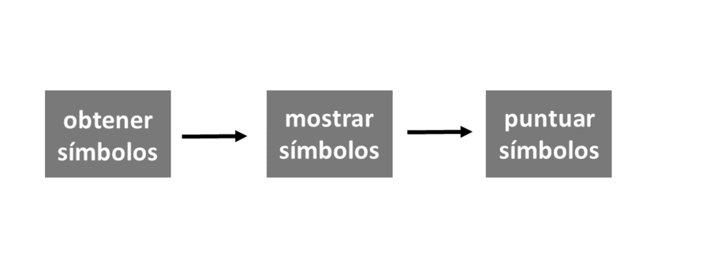
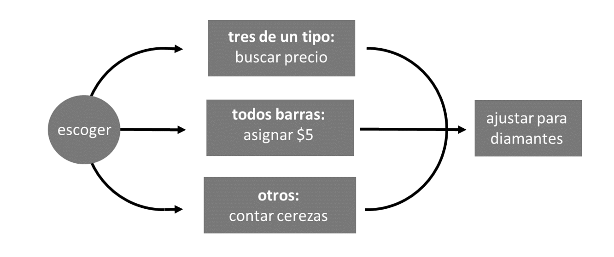
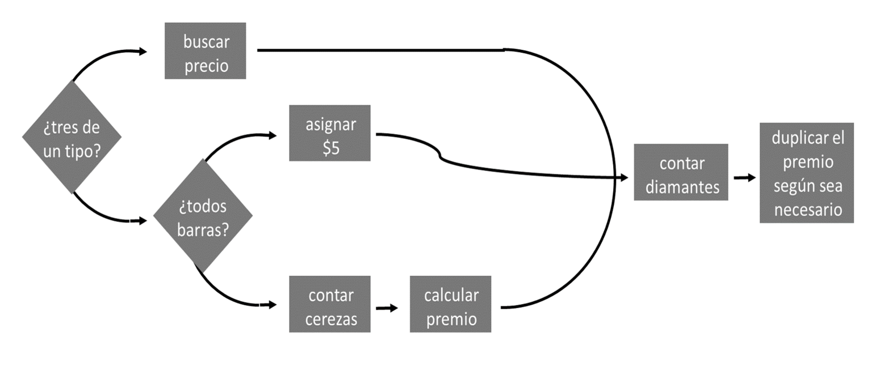

# Programas {#programs}

En este capítulo, construirá una máquina tragamonedas real y funcional que puede jugar ejecutando una función R. Cuando termines, podrás jugarlo así:

```r
play()
## 0 0 DD
## $0

play()
## 7 7 7
## $80
```

La función `play` necesitará hacer dos cosas. Primero, necesitará generar aleatoriamente tres símbolos; y, segundo, necesitará calcular un premio basado en esos símbolos. 

El primer paso es fácil de simular. Puede generar aleatoriamente tres símbolos con la función `sample`, tal como "lanzó" aleatoriamente dos dados en [Proyecto 1: Dados Ponderados](#dice). La siguiente función genera tres símbolos de un grupo de símbolos comunes de máquinas tragamonedas: diamantes (`DD`), sietes (`7`), barras triples (`BBB`), barras dobles (`BB`), barras simples (`B `), cerezas (`C`) y ceros (`0`). Los símbolos se seleccionan al azar y cada símbolo aparece con una probabilidad diferente:

```r
obt_simbolos() <- function() {
  rueda <- c("DD", "7", "BBB", "BB", "B", "C", "0")
  sample(rueda, size = 3, replace = TRUE, 
    prob = c(0.03, 0.03, 0.06, 0.1, 0.25, 0.01, 0.52))
}
```

Puedes usar `obt_simbolos()` para generar los símbolos usados en tu máquina tragamonedas: 

```r
obt_simbolos()
## "BBB" "0"   "C"  

obt_simbolos()
## "0" "0" "0"

obt_simbolos()
## "7" "0" "B"
```

`obt_simbolos` utiliza las probabilidades observadas en un grupo de Terminales de Video Lotería de Manitoba, Canadá. Estas máquinas tragamonedas se volvieron brevemente controvertidas en la década de 1990, cuando un reportero decidió probar su tasa de pago. Las máquinas parecían pagar solo 40 centavos por dólar, aunque el fabricante afirmó que pagarían 92 centavos por dólar. Los datos originales recopilados en las máquinas y una descripción de la controversia están disponibles en línea en [un artículo de revista de W. John Braun](http://bit.ly/jse_Braun). La controversia se calmó cuando las pruebas adicionales mostraron que el fabricante tenía razón.

Las máquinas tragamonedas de Manitoba utilizan el complicado esquema de pagos que se muestra en la Tabla \@ref(tab:prizes). Un jugador ganará un premio si obtiene:

* Tres del mismo tipo de símbolo (excepto tres ceros)
* Tres barras (de variedad mixta)
* Una o más cerezas

De lo contrario, el jugador no recibe ningún premio. 

El valor monetario del premio está determinado por la combinación exacta de símbolos y se modifica aún más por la presencia de diamantes. Los diamantes se tratan como "comodines", lo que significa que pueden considerarse cualquier otro símbolo si aumentara el premio de un jugador. Por ejemplo, un jugador que lanza `7` `7` `DD` ganaría un premio por obtener tres sietes. Sin embargo, hay una excepción a esta regla: un diamante no se puede considerar una cereza a menos que el jugador también obtenga una cereza real. Esto evita que una tirada sin fondos como `0` `DD` `0` se puntúe como `0` `C` `0`. 

Los diamantes también son especiales de otra manera. Cada diamante que aparece en una combinación duplica el importe del premio final. Así que `7` `7` `DD` en realidad tendría una puntuación _más alta_ que `7` `7` `7`. Tres sietes te darían $80, pero dos sietes y un diamante te darían $160. Un siete y dos diamantes sería aún mejor, lo que daría como resultado un premio que se ha duplicado dos veces, o $320. Un premio mayor ocurre cuando un jugador lanza `DD` `DD` `DD`. Luego, un jugador gana $100 duplicados tres veces, lo que equivale a $800.

Table: (\#tab:prizes) Cada juego de la máquina tragamonedas cuesta $1. Los símbolos de un jugador determinan cuánto gana. Los diamantes (`DD`) son comodines y cada diamante duplica el premio final. * = cualquier símbolo.

|Combinación|Premios($)
|-----------|--------
|`DD  DD  DD`|100
|`7  7  7`|80
|`BBB  BBB  BBB`|40
|`BB  BB  BB`|25
|`B  B  B`|10
|`C  C  C`|10
|Cualquier combinación de barras|5
|`C  C  *`|5
|`C  *  C`|5
|`*  C  C`|5
|`C  *  *`|2
|`*  C  *`|2
|`*  *  C`|2

Para crear su función `play`, necesitará escribir un programa que pueda tomar la salida de `obt_simbolos` y calcular el premio correcto basado en Tabla \@ref(tab:prizes).

En R, los programas se guardan como scripts de R o como funciones. Guardaremos su programa como una función llamada `puntuacion`. Cuando termines, podrás usar `puntuacion` para calcular un premio como este:

```r
puntuacion(c("DD", "DD", "DD"))
## 800
```

Después de eso, será fácil crear la máquina tragamonedas completa, así:

```r
play <- function() {
  simbolos <- obt_simbolos()
  print(simbolos)
  puntuacion(simbolos)
}
```

```{block2, type = "rmdnote"}
El comando `print` imprime su salida en la ventana de la consola, lo que hace que `print` sea una forma útil de mostrar mensajes desde el cuerpo de una función.
```

Puede notar que `play` llama a una nueva función, `print`. Esto ayudará a `play` a mostrar los tres símbolos de máquinas tragamonedas, ya que la última línea de la función no los devuelve. El comando `print` imprime su salida en la ventana de la consola, incluso si R lo llama desde dentro de una función.

En [Proyecto 1: Dados Ponderados](#dice), lo animé a escribir todo su código R en un script R, un archivo de texto donde puede redactar y guardar el código. Ese consejo será muy importante a medida que avance en este capítulo. Recuerde que puede abrir un script R en RStudio yendo a la barra de menú y haciendo clic en  File > New File > R Script.

## Estrategia

La puntuación de los resultados de las máquinas tragamonedas es una tarea compleja que requerirá un algoritmo complejo. Puede facilitar esta y otras tareas de codificación utilizando una estrategia simple:

* Dividir tareas complejas en subtareas simples.
* Utilice ejemplos concretos.
* Describa sus soluciones en español, luego conviértalas a R.

Comencemos por ver cómo puede dividir un programa en subtareas con las que es fácil trabajar.

Un programa es un conjunto de instrucciones paso a paso que debe seguir su computadora. En conjunto, estas instrucciones pueden lograr algo muy sofisticado. Por separado, cada paso individual probablemente será simple y directo. 

Puede facilitar la codificación identificando los pasos o subtareas individuales dentro de su programa. A continuación, puede trabajar en cada subtarea por separado. Si una subtarea parece complicada, intente dividirla nuevamente en subtareas pares que sean aún más simples. A menudo, puede reducir un programa de R en subtareas tan simples que cada una se puede realizar con una función preexistente. 

Los programas de R contienen dos tipos de subtareas: pasos secuenciales y casos paralelos.

### Pasos Secuenciales

Una forma de subdividir un programa es en una serie de pasos secuenciales. La función `play` toma el enfoque que se muestra en la Figura \@ref(fig:subdivide1). Primero, genera tres símbolos (paso 1), luego los muestra en la ventana de la consola (paso 2) y luego los puntúa (paso 3): 

```r
play <- function() {

  # step 1: genera simbolos
  simbolos <- obt_simbolos()

  # step 2: muestra los simbolos
  print(simbolos)

  # step 3: puntua los simbolos
  puntuacion(simbolos)
}
```

Para que R ejecute los pasos en secuencia, coloque los pasos uno tras otro en un script de R o en el cuerpo de una función. 

```{r subdivide1, echo = FALSE, fig.cap = "La función play utiliza una serie de pasos."}

```

### Casos Paralelos

Otra forma de dividir una tarea es detectar grupos de casos similares dentro de la tarea. Algunas tareas requieren diferentes algoritmos para diferentes grupos de entrada. Si puede identificar esos grupos, puede resolver sus algoritmos uno a la vez. 

Por ejemplo, `puntuacion` necesitará calcular el premio de una manera si `simbolos` contiene tres de una clase (en ese caso, `puntuacion` necesitará hacer coincidir el símbolo común con un premio). `puntuacion` necesitará calcular el premio de una segunda manera si los símbolos son todos barras (en ese caso, `puntuacion` puede asignar un premio de $5). Y, por último, `puntuacion` necesitará calcular el premio de una tercera forma si los símbolos no contienen tríos o todas las barras (en ese caso, `puntuacion` debe contar el número de cerezas presentes). `puntuacion` nunca usará estos tres algoritmos a la vez; siempre elegirá solo un algoritmo para ejecutar en función de la combinación de símbolos. 

Los diamantes complican todo esto porque los diamantes pueden ser tratados como comodines. Ignoremos eso por ahora y concentrémonos en el caso más simple donde los diamantes duplican el premio pero no son comodines. `puntuacion` puede duplicar el premio según sea necesario después de ejecutar uno de los siguientes algoritmos, como se muestra en la Figura \@ref(fig:subdivide2).

Agregar los casos de `puntuación` a los pasos de `play` revela una estrategia para el programa completo de máquinas tragamonedas, como se muestra en la Figura \@ref(fig:subdivide3).

Ya hemos resuelto los primeros pasos de esta estrategia. Nuestro programa puede obtener tres símbolos de máquinas tragamonedas con la función `obt_simbolos`. Entonces puede mostrar los símbolos con la función `print`. Ahora examinemos cómo el programa puede manejar los casos de puntuación paralela.

```{r subdivide2, echo = FALSE, fig.cap = "La función de puntuación debe distinguir entre casos paralelos."}

```

```{r subdivide3, echo = FALSE, fig.cap = "La simulación completa de la máquina tragamonedas implicará subtareas que se organizan tanto en serie como en paralelo."}
knitr::include_graphics("images/hopr_0703.png")
```

## Declaraciones if

Vincular casos en paralelo requiere un poco de estructura; su programa se enfrenta a una bifurcación en el camino cada vez que debe elegir entre casos. Puedes ayudar al programa a navegar por esta bifurcación con una instrucción `if`.

Una declaración `if` le dice a R que haga una tarea determinada para un caso determinado. En español dirías algo como: "Si esto es cierto, haz aquello". En R, dirías:

```r
if (esto) {
  aquello
}
```

El objeto `esto` debe ser una prueba lógica o una expresión de R que se evalúe a un solo `TRUE` o `FALSE`. Si `esto` se evalúa como `TRUE`, R ejecutará todo el código que aparece entre las llaves que siguen a la instrucción `if` (es decir, entre los símbolos `{` y `}`). Si `esto` se evalúa como `FALSE`, R omitirá el código entre llaves sin ejecutarlo.

Por ejemplo, podría escribir una declaración `if` que asegure que algún objeto, `num`, sea positivo:

```r
if (num < 0) {
  num <- num * -1
}
```

Si `num < 0` es `TRUE`, R multiplicará `num` por uno negativo, lo que hará que `num` sea positivo: 

```r
num <- -2

if (num < 0) {
  num <- num * -1
}

num
## 2
```

Si `num < 0` es `FALSE`, R no hará nada y `num` permanecerá como está: positivo (o cero):

```r
num <- 4

if (num < 0) {
  num <- num * -1
}

num
## 4
```

La condición de una declaración `if` debe evaluarse como un _único_ `TRUE` o `FALSE`. Si la condición crea un vector de `TRUE` y `FALSE` (que es más fácil de hacer de lo que piensa), su declaración `if` imprimirá un mensaje de advertencia y usará solo el primer elemento del vector. Recuerda que puedes condensar vectores de valores lógicos en un solo `TRUE` o `FALSE` con las funciones `any` y `all`.

No tienes que limitar tus declaraciones `if` a una sola línea de código; puede incluir tantas líneas como desee entre las llaves. Por ejemplo, el siguiente código usa muchas líneas para asegurar que `num` sea positivo. Las líneas adicionales imprimen algunas declaraciones informativas si `num` comienza como un número negativo. R omitirá todo el bloque de código, declaraciones `print` y todo, si `num` comienza como un número positivo:

```r
num <- -1

if (num < 0) {
  print("num es negativo.")
  print("No te preocupes, lo arreglaré.")
  num <- num * -1
  print("Ahora num es positivo.")
}
## "num es negativo."
## "No te preocupes, lo arreglaré."
## "Ahora num es positivo."

num
## 1
```

Pruebe las siguientes pruebas para desarrollar su comprensión de las declaraciones `if`.

**Ejercicio 10.1 (Cuestionario A)** ¿Qué devolverá esto?

```r
x <- 1
if (3 == 3) {
  x <- 2
}
x
```

```{solution}
El código devolverá el número 2. `x` comienza como 1, y luego R encuentra la declaración `if`. Dado que la condición se evalúa como `TRUE`, R ejecutará `x <- 2`, cambiando el valor de `x`.
```

**Ejercicio 10.2 (Cuestionario B)** ¿Qué devolverá esto?

```r
x <- 1
if (TRUE) {
  x <- 2
}
x
```

```{solution}
Este código también devolverá el número 2. Funciona igual que el código en la prueba A, excepto que la condición en esta declaración ya es `TRUE`. R ni siquiera necesita evaluarlo. Como resultado, se ejecutará el código dentro de la instrucción `if` y `x` se establecerá en 2. 
```

**Ejercicio 10.3 (Cuestionario C)** ¿Qué devolverá esto?

```r
x <- 1
if (x == 1) {
  x <- 2
  if (x == 1) {
    x <- 3
  }
}
x
```

```{solution}
Una vez más, el código devolverá el número 2. `x` comienza como 1, y la condición de la primera declaración `if` se evaluará como `TRUE`, lo que hace que R ejecute el código en el cuerpo de la esa declaración `if`. Primero, R establece `x` igual a 2, luego R evalúa la segunda declaración `if`, que está en el cuerpo de la primera. Esta vez `x == 1` se evaluará como `FALSE` porque `x` ahora es igual a 2. Como resultado, R ignora `x <- 3` y sale de ambas declaraciones `if`. 
```

## Declaraciones else

Las declaraciones `if` le dicen a R qué hacer cuando su condición es _verdadera_, pero también puede decirle a R qué hacer cuando la condición es _falsa_. `else` es una contraparte de `if` que extiende una declaración `if` para incluir un segundo caso. En español, dirías: "Si esto es cierto, haz el plan A; de lo contrario, haz el plan B". En R, dirías:

```r
if (esto) {
  Plan A
} else {
  Plan B
}
```

Cuando `esto` se evalúa como `TRUE`, R ejecutará el código en el primer conjunto de llaves, pero no el código en el segundo. Cuando `esto` se evalúa como `FALSE`, R ejecutará el código en el segundo conjunto de llaves, pero no en el primero. Puede utilizar este arreglo para cubrir todos los casos posibles. Por ejemplo, podría escribir algún código que redondee un decimal al entero más cercano.

Comience con un decimal:

```r
a <- 3.14
```

Luego aísle el componente decimal con `trunc`:

```r
dec <- a - trunc(a)
dec
## 0.14
```

```{block2, type = "rmdnote"}
`trunc` toma un número y devuelve solo la parte del número que aparece a la izquierda del lugar decimal (es decir, la parte entera del número). 
```

```{block2, type = "rmdnote"}
`a - trunc(a)` es una forma conveniente de devolver la parte decimal de `a`.
```

Luego use un árbol `if else` para redondear el número (hacia arriba o hacia abajo):

```r
if (dec >= 0.5) {
  a <- trunc(a) + 1
} else {
  a <- trunc(a)
}

a
## 3
```

Si su situación tiene más de dos casos que se excluyen mutuamente, puede unir varias declaraciones `if` y `else` agregando una nueva declaración `if` inmediatamente después de `else`. Por ejemplo:

```r
a <- 1
b <- 1

if (a > b) {
  print("¡A gana!")
} else if (a < b) {
  print("¡B gana!")
} else {
  print("Empate.")
}
## "Empate."
```

R trabajará a través de las condiciones `if` hasta que una se evalúe como `TRUE`, entonces R ignorará cualquier cláusula `if` y `else` restante en el árbol. Si ninguna condición se evalúa como `TRUE`, R ejecutará la declaración `else` final.

Si dos sentencias `if` describen eventos que se excluyen mutuamente, es mejor unir las sentencias `if` con `else if` que listarlas por separado. Esto le permite a R ignorar la segunda declaración `if` siempre que la primera devuelva un `TRUE`, lo que ahorra trabajo.

Puede usar `if` y `else` para vincular las subtareas en su función de máquina tragamonedas. Abra un script R nuevo y copie este código en él. El código será el esqueleto de nuestra función `puntuación` final. Compáralo con el diagrama de flujo para `puntuación` en la Figura \@ref(fig:subdivide2):

```r
if ( # Caso 1: todos son iguales <1>) {
  premio <- # Buscar el premio <3>
} else if ( # Caso 2: todos barras <2> ) {
  premio <- # asignar $5 <4>
} else {
  # contar cerezas <5>
  premio <- # calcular el premio <7>
}

# contar diamantes <6>
# duplicar el premio si es necesario <8>
```

Nuestro esqueleto es bastante incompleto; hay muchas secciones que son solo comentarios de código en lugar de código real. Sin embargo, hemos reducido el programa a ocho subtareas simples: 

**<1>** - Prueba si los símbolos son tres de una clase.
**<2>** - Prueba si los símbolos son solo barras.
**<3>** - Busque el premio de tres iguales según el símbolo común.
***<4>** - Asigne un premio de $5.
**<5>** - Cuenta el número de cerezas.
***<6>** - Cuenta el número de diamantes.
***<7>** - Calcula un premio basado en el número de cerezas.
***<8>** - Ajustar el premio por diamantes.  

Si lo desea, puede reorganizar su diagrama de flujo en torno a estas tareas, como en la Figura \@ref(fig:subdivide4). El gráfico describirá la misma estrategia, pero de una manera más precisa. Usaré una forma de diamante para simbolizar una decisión `if else`.

```{r subdivide4, echo = FALSE, fig.cap = "puntuacion puede navegar tres casos con dos decisiones if else. También podemos dividir algunas de nuestras tareas en dos pasos."}

```

Ahora podemos trabajar en las subtareas una a la vez, agregando código de R al árbol `if` a medida que avanzamos. Cada subtarea será fácil de resolver si configura un ejemplo concreto para trabajar e intenta describir una solución en español antes de codificar en R.

La primera subtarea le pide que pruebe si los símbolos son tres de una clase. ¿Cómo debería comenzar a escribir el código para esta subtarea?

Sabes que la función `puntuacion` final se verá así:

```r
puntuacion <- function(simbolos) {

  # calcular el premio

  premio
}
```

Su argumento, `simbolos`, será la salida de `obt_simbolos`, un vector que contiene tres cadenas de caracteres. Podría comenzar a escribir `puntuacion` como lo he escrito, definiendo un objeto llamado `puntuacion` y luego completando lentamente el cuerpo de la función. Sin embargo, esto sería una mala idea. La función eventual tendrá ocho partes separadas, y no funcionará correctamente hasta que _todas_ esas partes estén escritas (y funcionen correctamente). Esto significa que tendría que escribir toda la función `puntuacion` antes de poder probar cualquiera de las subtareas. Si `puntuacion` no funciona, lo cual es muy probable, no sabrá qué subtarea debe corregirse.

Puede ahorrarse tiempo y dolores de cabeza si se enfoca en una subtarea a la vez. Para cada subtarea, cree un ejemplo concreto en el que pueda probar su código. Por ejemplo, sabe que `puntuacion` necesitará trabajar en un vector llamado `simbolos` que contiene tres cadenas de caracteres. Si crea un vector real llamado `simbolos`, puede ejecutar el código para muchas de sus subtareas en el vector a medida que avanza:

```r
simbolos <- c("7", "7", "7")
```

Si una pieza de código no funciona en `simbolos`, sabrá que necesita arreglarlo antes de continuar. Puedes cambiar el valor de `simbolos` de subtarea a subtarea para asegurarte de que tu código funcione en todas las situaciones:

```r
simbolos <- c("B", "BB", "BBB")
simbolos <- c("C", "DD", "0")
```

Solo combine sus subtareas en una función de `puntuacion` una vez que cada subtarea funcione en un ejemplo concreto. Si sigue este plan, pasará más tiempo usando sus funciones y menos tratando de averiguar por qué no funcionan.

Después de establecer un ejemplo concreto, intente describir cómo realizará la subtarea en español. Cuanto más precisamente pueda describir su solución, más fácil será escribir su código de R.

Nuestra primera subtarea nos pide que "probemos si los símbolos son tres iguales". Esta frase no me sugiere ningún código de R útil. Sin embargo, podría describir una prueba más precisa para el trío: tres símbolos serán iguales si el primer símbolo es igual al segundo y el segundo símbolo es igual al tercero. O, aún más precisamente:

_Un vector llamado `simbolos` contendrá tres del mismo símbolo si el primer elemento de `simbolos` es igual al segundo elemento de `simbolos` y el segundo elemento de `simbolos` es igual al tercer elemento de `simbolos`_.

**Ejercicio 10.4 (Escribe una Prueba)** Convierta la declaración anterior en una prueba lógica escrita en R. Use su conocimiento de pruebas lógicas, operadores booleanos y subconjuntos de [Notación de R](#notation). La prueba debería funcionar con el vector `simbolos` y devolver un `TRUE` _si y solo si_ cada elemento en `simbolos` es el mismo. Asegúrese de probar su código en `simbolos`.

```{solution}
Aquí hay un par de formas de probar que `simbolos` contiene tres del mismo símbolo. El primer método es paralelo a la sugerencia en español anterior, pero hay otras formas de hacer la misma prueba. No hay una respuesta correcta o incorrecta, siempre y cuando su solución funcione, lo cual es fácil de comprobar porque ha creado un vector llamado `simbolos`:
```

```r
simbolos
##  "7" "7" "7"

simbolos[1] == simbolos[2] & simbolos[2] == simbolos[3]
## TRUE

simbolos[1] == simbolos[2] & simbolos[1] == simbolos[3]
## TRUE

all(simbolos == simbolos[1])
## TRUE
```
A medida que su vocabulario de funciones de R se amplíe, pensará en más formas de realizar tareas básicas. Un método que me gusta para verificar si tres son iguales es:

```r
length(unique(simbolos)) == 1
```

La función `unique` devuelve cada término único que aparece en un vector. Si su vector `simbolos` contiene tres iguales (es decir, un término único que aparece tres veces), entonces `unique(simbolos)` devolverá un vector de longitud `1`.

Ahora que tiene una prueba que funciona, puede agregarla a la secuencia de comandos de su máquina tragamonedas:

```r
iguales <- simbolos[1] == simbolos[2] && simbolos[2] == simbolos[3]

if (iguales) {
  premio <- # Buscar el premio
} else if ( # Caso 2: todos barras) {
  premio <- # asignar $5
} else {
  # contar cerezas
  premio <- # calcular el premio
}

# contar diamantes
# duplicar el premio si es necesario
```

```{block2, type = "rmdnote"}
`&&` y `||` se comportan como `&` y `|` pero a veces pueden ser más eficientes. Los operadores dobles no evaluarán la segunda prueba en un par de pruebas si la primera prueba aclara el resultado. Por ejemplo, si `simbolos[1]` no es igual a `simbolos[2]` en la siguiente expresión, `&&` no evaluará `simbolos[2] == simbolos[3]`; puede devolver inmediatamente un `FALSE` para toda la expresión (porque `FALSE & TRUE` y `FALSE & FALSE` ambos se evalúan como `FALSE`). Esta eficiencia puede acelerar sus programas; sin embargo, los operadores dobles no son apropiados en todas partes. `&&` y `||` no están vectorizados, lo que significa que solo pueden manejar una sola prueba lógica en cada lado del operador.
```

El segundo caso de premio ocurre cuando todos los símbolos son un tipo de barra, por ejemplo, `B`, `BB` y `BBB`. Empecemos por crear un ejemplo concreto con el que trabajar:

```r
simbolos <- c("B", "BBB", "BB")
```


**Ejercicio 10.5 (Probar si todos son barras)** Use los operadores lógicos y booleanos de R para escribir una prueba que determinará si un vector llamado `simbolos` contiene solo símbolos que son un tipo de barra. Compruebe si su prueba funciona con nuestro vector de `simbolos` de ejemplo. Recuerde describir cómo debería funcionar la prueba en español y luego convertir la solución a R.


```{solution}
Al igual que con muchas cosas en R, hay varias formas de probar si los `simbolos` contienen todos barras. Por ejemplo, podría escribir una prueba muy larga que use múltiples operadores booleanos, como esta:
```

```r
(simbolos[1] == "B" | simbolos[1] == "BB" | simbolos[1] == "BBB") &
  (simbolos[2] == "B" | simbolos[2] == "BB" | simbolos[2] == "BBB") &
  (simbolos[3] == "B" | simbolos[3] == "BB" | simbolos[3] == "BBB")
## TRUE
```

Sin embargo, esta no es una solución muy eficiente, porque R tiene que ejecutar nueve pruebas lógicas (y usted tiene que escribirlas). A menudo puede reemplazar múltiples operadores `|` con un único `%in%`. Además, puede verificar que una prueba sea verdadera para cada elemento en un vector con `all`. Estos dos cambios acortan el código anterior a:

```r
all(simbolos %in% c("B", "BB", "BBB"))
## TRUE
```

Agreguemos este código a nuestro script:

```r
iguales <- simbolos[1] == simbolos[2] && simbolos[2] == simbolos[3]
barras <- simbolos %in% c("B", "BB", "BBB")

if (iguales) {
  prize <- # Buscar el premio
} else if (all(barras)) {
  prize <- # asiganr $5
} else {
  # contar cerezas
  premio <- # calcular el premio
}

# contar diamantes
# duplicar el premio si es necesario
```

Es posible que haya notado que dividí esta prueba en dos pasos, `barras` y `all(barras)`. Eso es solo una cuestión de preferencia personal. Siempre que sea posible, me gusta escribir mi código para que pueda leerse con nombres de funciones y objetos que transmitan lo que hacen.

También puede haber notado que nuestra prueba para el Caso 2 capturará algunos símbolos que deberían estar en el Caso 1 porque contienen tres de una clase:

```r
simbolos <- c("B", "B", "B")
all(simbolos %in% c("B", "BB", "BBB"))
## TRUE
```

Eso no será un problema, sin embargo, porque hemos conectado nuestros casos con `else if` en el árbol `if`. Tan pronto como R llegue a un caso que se evalúe como `VERDADERO`, se saltará el resto del árbol. Piénselo de esta manera: cada `else` le dice a R que solo ejecute el código que le sigue _si no se ha cumplido ninguna de las condiciones anteriores_. Entonces, cuando tenemos tres del mismo tipo de barra, R evaluará el código para el Caso 1 y luego omitirá el código para el Caso 2 (y el Caso 3).

Nuestra próxima subtarea es asignar un premio a los `simbolos`. Cuando el vector de `simbolos` contiene tres del mismo símbolo, el premio dependerá de qué símbolo haya tres. Si hay tres `DD`s, el premio será de $100; si hay tres `7`s, el premio será de $80; y así.

Esto sugiere otro árbol `if`. Podrías asignar un premio con algún código como este:

```r
if (iguales) {
  simbolo <- simbolos[1]
  if (simbolo == "DD") {
    premmio <- 800
  } else if (simbolo == "7") {
    premio <- 80
  } else if (simbolo == "BBB") {
    premio <- 40
  } else if (simbolo == "BB") {
    premio <- 5
  } else if (simbolo == "B") {
    premio <- 10
  } else if (simbolo == "C") {
    premio <- 10
  } else if (simbol == "0") {
    premio <- 0
  }
}
```

Si bien este código funcionará, es un poco largo de escribir y leer, y puede requerir que R realice varias pruebas lógicas antes de entregar el premio correcto. Podemos hacerlo mejor con un método diferente.

## Tablas de Búsqueda

Muy a menudo en R, la forma más sencilla de hacer algo implicará la creación de subconjuntos. ¿Cómo podrías usar subconjuntos aquí? Como conoce la relación exacta entre los símbolos y sus premios, puede crear un vector que capture esta información. Este vector puede almacenar símbolos como nombres y valores de premios como elementos:

```r
pagos <- c("DD" = 100, "7" = 80, "BBB" = 40, "BB" = 25, 
  "B" = 10, "C" = 10, "0" = 0)
pagos
##  DD   7 BBB  BB   B   C   0 
## 100  80  40  25  10  10   0 
```

Ahora puede extraer el premio correcto para cualquier símbolo subdividiendo el vector con el nombre del símbolo:

```r
pagos["DD"]
##  DD 
## 100 

pagos["B"]
##  B
## 10
```

Si desea dejar atrás el nombre del símbolo al crear subconjuntos, puede ejecutar la función `unname` en la salida:

```r
unname(pagos["DD"])
## 100 
```

`unname` devuelve una copia de un objeto con el atributo de nombres eliminado.

`pagos` es un tipo de _tabla de búsqueda_, un objeto de R que puede usar para buscar valores. Subdividir `pagos` proporciona una forma sencilla de encontrar el premio de un símbolo. No requiere muchas líneas de código y hace la misma cantidad de trabajo ya sea que su símbolo sea `DD` o `0`. Puede crear tablas de búsqueda en R mediante la creación de objetos con nombre que se pueden dividir en subconjuntos de formas inteligentes.

Lamentablemente, nuestro método no es del todo automático; necesitamos decirle a R qué símbolo buscar en `pagos`. ¿Tenemos? ¿Qué pasaría si dividieras los `pagos` por `simbolos[1]`? Probemos:

```r
simbolos <- c("7", "7", "7")
simbolos[1]
## "7"

pagos[simbolos[1]]
##  7 
## 80 

simbolos <- c("C", "C", "C")
pagos[simbolos[1]]
##  C 
## 10 
```

No necesita saber el símbolo exacto para buscar porque puede decirle a R que busque cualquier símbolo que esté en `simbolos`. Puede encontrar este símbolo con `simbolos[1]`, `simbolos[2]` o `simbolos[3]`, porque cada uno contiene el mismo símbolo en este caso. Ahora tiene una forma sencilla y automatizada de calcular el premio cuando los `simbolos` contienen tres iguales. Vamos a agregarlo a nuestro código y luego veamos el Caso 2:

```r
iguales <- simbolos[1] == simbolos[2] && simbolos[2] == simbolos[3]
barras <- simbolos %in% c("B", "BB", "BBB")

if (iguales) {
  pagos <- c("DD" = 100, "7" = 80, "BBB" = 40, "BB" = 25, 
    "B" = 10, "C" = 10, "0" = 0)
  premio <- unname(pagos[simbolos[1]])
} else if (all(barras)) {
  premio <- # asignar $5
} else {
  # contar cerezas
  premio <- # calcular el premio
}

# contar diamantes
# duplicar el premio si es necesario
```

El caso 2 ocurre cuando los símbolos son todos barras. En ese caso, el premio será de $5, que es fácil de asignar:


```r
iguales <- simbolos[1] == simbolos[2] && simbolos[2] == simbolos[3]
barras <- simbolos %in% c("B", "BB", "BBB")

if (iguales) {
  pagos <- c("DD" = 100, "7" = 80, "BBB" = 40, "BB" = 25, 
    "B" = 10, "C" = 10, "0" = 0)
  premio <- unname(pagos[simbolos[1]])
} else if (all(barras)) {
  premio <- 5
} else {
  # contar cerezas
  premio <- # calcular el premio
}

# contar diamantes
# duplicar el premio si es necesario
```

Ahora podemos trabajar en el último caso. Aquí, necesitará saber cuántas cerezas hay en los `simbolos` antes de poder calcular un premio.

**Ejercicio 10.6 (Encuentra las C)** ¿Cómo puedes saber qué elementos de un vector llamado `simbolos` son una `C`? Diseñe una prueba y pruébela.

```{block2, type = "rmdnote"}
**Desafío**

¿Cómo podrías contar el número de 'C' en un vector llamado 'símbolos'? Recuerda las reglas de coerción de R.
```

```{solution}
Como siempre, trabajemos con un ejemplo real:
```

```r
simbolos <- c("C", "DD", "C")
```

Una forma de probar las cerezas sería verificar cuál de los símbolos, si alguno, es una `C`:

```r
simbolos == "C"
## TRUE FALSE  TRUE
```

Sería aún más útil contar cuántos de los símbolos son cerezas. Puede hacer esto con `sum`, que espera una entrada numérica, no lógica. Sabiendo esto, R forzará los `TRUE` y `FALSE` a `1` y `0` antes de hacer la suma. Como resultado, `sum` devolverá el número de `TRUE`, que también es el número de cerezas:

```r
sum(simbolos == "C")
## 2
```

Puede usar el mismo método para contar la cantidad de diamantes en `simbolos`:

```r
sum(simbolos == "DD")
## 1
```

Agreguemos estas dos subtareas al esqueleto del programa:

```r
iguales <- simbolos[1] == simbolos[2] && simbolos[2] == simbolos[3]
barras <- simbolos %in% c("B", "BB", "BBB")

if (iguales) {
  pagos <- c("DD" = 100, "7" = 80, "BBB" = 40, "BB" = 25, 
    "B" = 10, "C" = 10, "0" = 0)
  premio <- unname(pagos[simbolos[1]])
} else if (all(barras)) {
  premio <- 5
} else {
  cerezas <- sum(simbolos == "C")
  premio <- # calcular el premio
}

diamantes <- sum(simbolos == "DD")
# duplicar el premio si es necesario
```

Dado que el Caso 3 aparece más abajo en el árbol `if` que los Casos 1 y 2, el código del Caso 3 solo se aplicará a los jugadores que no tengan trío o todas las barras. De acuerdo con el esquema de pagos de la máquina tragamonedas, estos jugadores ganarán $5 si tienen dos cerezas y $2 si tienen una cereza. Si el jugador no tiene cerezas, obtiene un premio de $0. No necesitamos preocuparnos por tres cerezas porque ese resultado ya está cubierto en el Caso 1. 

Como en el Caso 1, podría escribir un árbol `if` que maneje cada combinación de cerezas, pero al igual que en el Caso 1, esta sería una solución ineficiente: 

```r
if (cerezas == 2) {
  premio <- 5
} else if (cerezas == 1) {
  premio <- 2
} else {}
  premio <- 0
}
```

Nuevamente, creo que la mejor solución implicará subconjuntos. Si se siente ambicioso, puede intentar resolver esta solución por su cuenta, pero aprenderá con la misma rapidez trabajando mentalmente en la siguiente solución propuesta. 

Sabemos que nuestro premio debe ser $0 si no tenemos cerezas, $2 si tenemos una cereza y $5 si tenemos dos cerezas. Puede crear un vector que contenga esta información. Esta será una tabla de búsqueda muy simple:

```r
c(0, 2, 5)
```

Ahora, como en el Caso 1, puede crear subconjuntos del vector para recuperar el premio correcto. En este caso, los premios no se identifican con el nombre de un símbolo, sino con el número de cerezas presentes. ¿Tenemos esa información? Sí, se almacena en `cerezas`. Podemos usar subconjuntos enteros básicos para obtener el premio correcto de la tabla de búsqueda anterior, por ejemplo, `c(0, 2, 5)[1]`. 

`cerezas` no es exactamente adecuado para subconjuntos enteros porque podría contener un cero, pero eso es fácil de arreglar. Podemos crear un subconjunto con `cerezas + 1`. Ahora, cuando `cerezas` es igual a cero, tenemos:

```r
cerezas + 1
## 1

c(0, 2, 5)[cerezas + 1]
## 0
```

Cuando `cerezas` es igual a uno, tenemos:

```r
cerezas + 1
## 2

c(0, 2, 5)[cerezas + 1]
## 2
```

Y cuando `cerezas` es igual a dos, tenemos:

```r
cerezas + 1
## 3

c(0, 2, 5)[cerezas + 1]
## 5
```

Examine estas soluciones hasta que esté seguro de que arrojan el premio correcto por cada número de cerezas. Luego agregue el código a su secuencia de comandos, de la siguiente manera:

```r
iguales <- simbolos[1] == simbolos[2] && simbolos[2] == simbolos[3]
barras <- simbolos %in% c("B", "BB", "BBB")

if (iguales) {
  pagos <- c("DD" = 100, "7" = 80, "BBB" = 40, "BB" = 25, 
    "B" = 10, "C" = 10, "0" = 0)
  premio <- unname(pagos[simbolos[1]])
} else if (all(barras)) {
  premio <- 5
} else {
  cerezas <- sum(simbolos == "C")
  premio <- c(0, 2, 5)[cerezas + 1]
}

diamantes <- sum(simbolos == "DD")
# duplicar el premio si es necesario
```

```{block2, type = "rmdimportant"}
**Tablas de Búsqueda vs Árboles if**

Esta es la segunda vez que creamos una tabla de búsqueda para evitar escribir un árbol `if`. ¿Por qué es útil esta técnica y por qué sigue apareciendo? Muchos árboles `if` en R son esenciales. Proporcionan una forma útil de decirle a R que use diferentes algoritmos en diferentes casos. Sin embargo, los árboles `if` no son apropiados en todas partes.

Los `if` árboles tienen un par de inconvenientes. En primer lugar, requieren que R ejecute varias pruebas a medida que avanza por el árbol `if`, lo que puede generar trabajo innecesario. En segundo lugar, como verá en [Velocidad](#speed), puede ser difícil usar árboles `if` en código vectorizado, un estilo de código que aprovecha las fortalezas de programación de R para crear programas rápidos. Las tablas de búsqueda no sufren ninguno de estos inconvenientes.

No podrá reemplazar cada árbol `if` con una tabla de búsqueda, ni debería hacerlo. Sin embargo, generalmente puede usar tablas de búsqueda para evitar asignar variables con árboles `if`. Como regla general, use un árbol `if` si cada rama del árbol ejecuta un _código_ diferente. Use una tabla de búsqueda si cada rama del árbol solo asigna un _valor_ diferente.

Para convertir un árbol `if` en una tabla de búsqueda, identifique los valores que se asignarán y guárdelos en un vector. A continuación, identifique los criterios de selección utilizados en las condiciones del árbol `if`. Si las condiciones usan cadenas de caracteres, proporcione los nombres de sus vectores y use subconjuntos basados en nombres. Si las condiciones usan números enteros, use subconjuntos basados en números enteros.
```

La subtarea final es duplicar el premio una vez por cada diamante presente. Esto significa que el premio final será un múltiplo del premio actual. Por ejemplo, si no hay diamantes presentes, el premio será:

```r
premio * 1      # 1 = 2 ^ 0
```

Si un diamante está presente, será:

```r
premio * 2      # 2 = 2 ^ 1
```

Si hay dos diamantes presentes, será:

```r
premio * 4      # 4 = 2 ^ 2
```

Y si hay tres diamantes presentes, será:

```r
premio * 8      # 8 = 2 ^ 3
```

¿Puedes pensar en una manera fácil de manejar esto? ¿Qué tal algo similar a estos ejemplos? 

**Ejercicio 10.7 (Adjuste para Diamantes)** Escribe un método para ajustar el `premio` basado en `diamantes`. Describa primero una solución en español y luego escriba su código. 

```{solution}
Aquí hay una solución concisa inspirada en el patrón anterior. El premio ajustado será igual a:
```

```r
premio * 2 ^ diamantes
```

lo que nos da nuestro script final de `puntuacion`:

```r
iguales <- simbolos[1] == simbolos[2] && simbolos[2] == simbolos[3]
barras <- simbolos %in% c("B", "BB", "BBB")

if (iguales) {
  pagos <- c("DD" = 100, "7" = 80, "BBB" = 40, "BB" = 25, 
             "B" = 10, "C" = 10, "0" = 0)
  premio <- unname(pagos[simbolos[1]])
} else if (all(barras)) {
  premio <- 5
} else {
  cerezas <- sum(simbolos == "C")
  premio <- c(0, 2, 5)[cerezas + 1]
}

diamantes <- sum(simbolos == "DD")
premio * 2 ^ diamantes
```

## Comentarios de Código

Ahora tiene un script de puntuacion que puede guardar en una función. Sin embargo, antes de guardar su secuencia de comandos, considere agregar comentarios a su código con un `#`. Los comentarios pueden hacer que su código sea más fácil de entender al explicar _por qué_ el código hace lo que hace. También puede usar comentarios para dividir programas largos en fragmentos escaneables. Por ejemplo, incluiría tres comentarios en el código `puntuacion`:

```r
# identificar caso
iguales <- simbolos[1] == simbolos[2] && simbolos[2] == simbolos[3]
barras <- simbolos %in% c("B", "BB", "BBB")

# obtener premio
if (iguales) {
  pagos <- c("DD" = 100, "7" = 80, "BBB" = 40, "BB" = 25, 
             "B" = 10, "C" = 10, "0" = 0)
  premio <- unname(pagos[simbolos[1]])
} else if (all(barras)) {
  premio <- 5
} else {
  cerezas <- sum(simbolos == "C")
  premio <- c(0, 2, 5)[cerezas + 1]
}

# ajustar para diamantes
diamantes <- sum(simbolos == "DD")
premio * 2 ^ diamantes
```

Ahora que cada parte de tu código funciona, puedes envolverlo en una función con los métodos que aprendiste en [Escribir tus propias funciones](#write-functions). Utilice la opción Extract Function de RStudio en la barra de menú en Code, o utilice la función `function`. Asegúrese de que la última línea de la función devuelva un resultado (lo hace) e identifique los argumentos utilizados por su función. A menudo, los ejemplos concretos que utilizó para probar su código, como `símbolos`, se convertirán en los argumentos de su función. Ejecute el siguiente código para comenzar a usar la función `puntuacion`:

```r
puntuacion <- function (simbolos) {
  # identificar caso
  iguales <- simbolos[1] == simbolos[2] && simbolos[2] == simbolos[3]
  barras <- simbolos %in% c("B", "BB", "BBB")

  # obtener premio
  if (iguales) {
    pagos <- c("DD" = 100, "7" = 80, "BBB" = 40, "BB" = 25, 
             "B" = 10, "C" = 10, "0" = 0)
    premio <- unname(pagos[simbolos[1]])
  } else if (all(barras)) {
    premio <- 5
  } else {
    cerezas <- sum(simbolos == "C")
    premio <- c(0, 2, 5)[cerezas + 1]
  }

  # ajustar para diamantes
  diamantes <- sum(simbolos == "DD")
  premio * 2 ^ diamantes
}
```

Una vez que haya definido la función `puntuacion`, la función `play` también funcionará: 

```r
play <- function() {
  simbolos <- obt_simbolos()
  print(simbolos)
  puntuacion(simbolos)
}
```

Ahora es fácil jugar en la máquina tragamonedas:

```r
play()
## "0"  "BB" "B" 
## 0

play()
## "DD"  "0" "B"  
## 0

play()
## "BB" "BB" "B" 
## 25
```

## Resumen

Un programa en R es un conjunto de instrucciones que su computadora debe seguir y que se ha organizado en una secuencia de pasos y casos. Esto puede hacer que los programas parezcan simples, pero no se deje engañar: puede crear resultados complicados con la combinación correcta de pasos simples (y casos).

Como programador, es más probable que te engañen de la manera opuesta. Un programa puede parecer imposible de escribir cuando sabes que debe hacer algo impresionante. No se asuste en estas situaciones. Divida el trabajo que tiene delante en tareas simples y luego vuelva a dividir las tareas. Puede visualizar la relación entre las tareas con un diagrama de flujo si le ayuda. Luego trabaje en las subtareas una a la vez. Describa las soluciones en español y luego conviértalas a código de R. Pruebe cada solución con ejemplos concretos a medida que avanza. Una vez que cada una de sus subtareas funcione, combine su código en una función que pueda compartir y reutilizar.

R proporciona herramientas que pueden ayudarlo a hacer esto. Puede administrar casos con declaraciones `if` y `else`. Puede crear una tabla de búsqueda con objetos y subconjuntos. Puede agregar comentarios de código con `#`. Y puede guardar sus programas como una función con `function`

Las cosas suelen salir mal cuando la gente escribe programas. Dependerá de usted encontrar la fuente de cualquier error que ocurra y corregirlo. Debería ser fácil encontrar la fuente de sus errores si utiliza un enfoque paso a paso para escribir funciones, escribir y luego probar, un poco a la vez. Sin embargo, si la fuente de un error se le escapa, o se encuentra trabajando con grandes fragmentos de código no probado, considere usar las herramientas de depuración integradas de R, descritas en [Depuración de Código de R](#debug).

Los siguientes dos capítulos le enseñarán más herramientas que puede usar en sus programas. A medida que domine estas herramientas, le resultará más fácil escribir programas en R que le permitan hacer lo que desee con sus datos. En [S3](#s3), aprenderá a usar el sistema S3 de R, una mano invisible que da forma a muchas partes de R. Usará el sistema para crear una clase personalizada para la salida de su máquina tragamonedas y le dirá a R cómo mostrar objetos que tienen tu clase.
